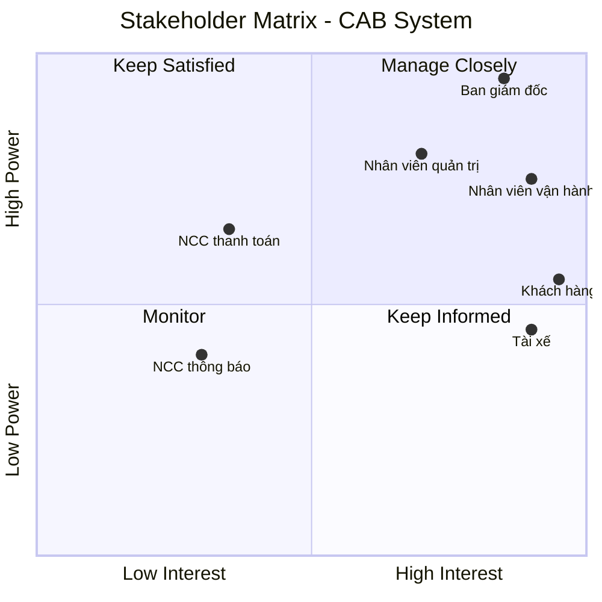
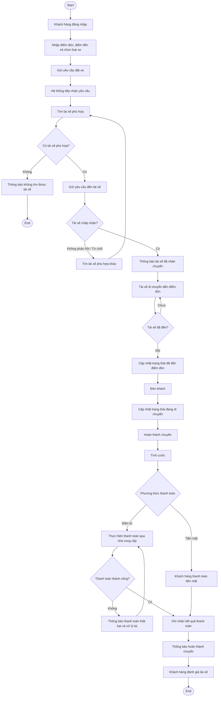
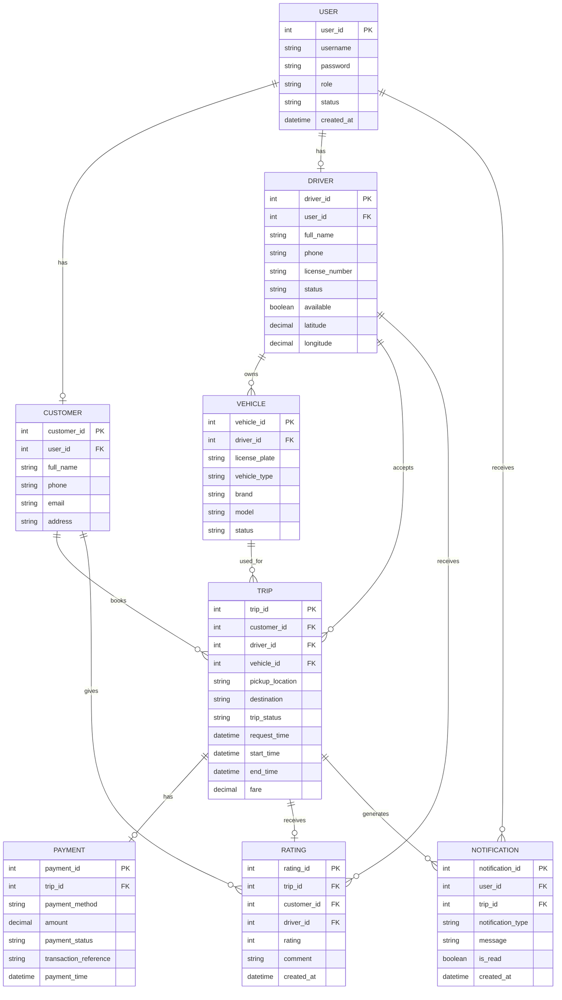
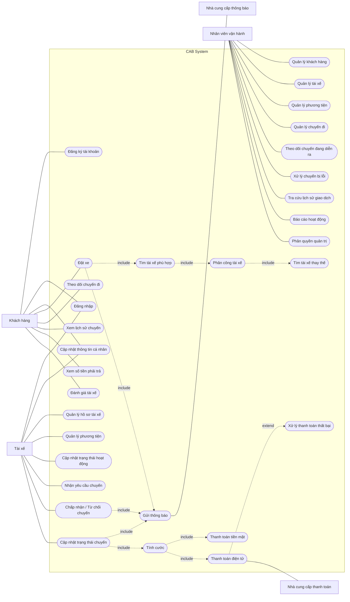

# Stakeholders
| Stakeholder | Vai trò |
|---|---|
| **Ban giám đốc Công ty ABC** | Định hướng mục tiêu kinh doanh, đưa ra kỳ vọng đối với hệ thống và theo dõi các chỉ số hoạt động như số lượng chuyến, doanh thu, tỷ lệ hoàn thành, tỷ lệ hủy và hiệu quả của tài xế. |
| **Khách hàng** | Sử dụng hệ thống để đăng ký tài khoản, đặt xe, theo dõi chuyến đi, xem lịch sử chuyến, thanh toán và đánh giá tài xế. |
| **Tài xế** | Đăng ký hoặc được tạo tài khoản, quản lý hồ sơ và phương tiện, nhận hoặc từ chối chuyến, cập nhật trạng thái chuyến và cung cấp thông tin vị trí. |
| **Nhân viên vận hành** | Quản lý khách hàng, tài xế, phương tiện và chuyến đi; theo dõi các chuyến đang diễn ra, kiểm tra trạng thái tài xế và hỗ trợ xử lý các trường hợp chuyến bị lỗi. |
| **Nhân viên quản trị có quyền cao** | Thực hiện các chức năng quản trị nhạy cảm theo quyền được phân công; các thao tác quản trị phải được kiểm soát quyền truy cập. |
| **Nhà cung cấp dịch vụ thanh toán** | Cung cấp dịch vụ xử lý thanh toán điện tử cho hệ thống CAB; hệ thống CAB không lưu trực tiếp thông tin nhạy cảm của thẻ hoặc tài khoản thanh toán. |
| **Nhà cung cấp dịch vụ thông báo** | Cung cấp các kênh gửi thông báo đến khách hàng và tài xế về trạng thái đặt xe, chuyến đi và thanh toán. |

# Business Goals
| ID | Business Goal | Mô tả |
|---|---|---|
| BG1 | Xây dựng nền tảng CAB có khả năng mở rộng | Xây dựng hệ thống có khả năng phục vụ số lượng lớn khách hàng và tài xế, đồng thời dễ dàng mở rộng thêm tính năng, dịch vụ và thành phần kỹ thuật trong tương lai. |
| BG2 | Tự động hóa quy trình tìm và phân công tài xế | Tự động xác định và ưu tiên tài xế phù hợp, gần khách hàng; tiếp tục tìm tài xế khác khi tài xế được đề xuất không phản hồi hoặc từ chối chuyến. |
| BG3 | Nâng cao trải nghiệm khách hàng | Giúp khách hàng thuận tiện trong việc đặt xe, theo dõi trạng thái chuyến đi, xem thông tin tài xế, thời gian dự kiến đến, lịch sử chuyến, thanh toán và đánh giá tài xế. |
| BG4 | Nâng cao hiệu quả quản lý và vận hành | Cung cấp giao diện quản trị để quản lý khách hàng, tài xế, phương tiện và chuyến đi; theo dõi chuyến đang diễn ra và hỗ trợ xử lý các trường hợp lỗi. |
| BG5 | Quản lý thanh toán và doanh thu hiệu quả | Hỗ trợ tính cước, thanh toán tiền mặt và điện tử, tích hợp với nhà cung cấp thanh toán bên ngoài và quản lý thông tin giao dịch tập trung. |
| BG6 | Đảm bảo hệ thống ổn định, bảo mật và liên tục | Đảm bảo hệ thống hoạt động ổn định khi nhu cầu tăng cao, các thành phần có thể mở rộng độc lập, đồng thời bảo vệ dữ liệu và kiểm soát quyền truy cập. |
| BG7 | Hỗ trợ quản lý và ra quyết định dựa trên dữ liệu | Cung cấp báo cáo về số lượng chuyến, doanh thu, tỷ lệ hoàn thành, tỷ lệ hủy và hiệu quả hoạt động của tài xế. |

# MVP Modules

| STT | Module | Mô tả | Chức năng chính |
|---|---|---|---|
| 1 | **Quản lý tài khoản & xác thực** | Quản lý tài khoản và xác thực người dùng. | Đăng ký, đăng nhập, cập nhật thông tin cá nhân, xác thực tài khoản. |
| 2 | **Quản lý khách hàng** | Quản lý thông tin và dữ liệu liên quan đến khách hàng. | Quản lý thông tin cá nhân, xem lịch sử chuyến đi, xem thông tin thanh toán liên quan. |
| 3 | **Quản lý tài xế & phương tiện** | Quản lý hồ sơ tài xế, phương tiện và trạng thái hoạt động. | Đăng ký/tạo tài khoản tài xế, cập nhật hồ sơ, quản lý phương tiện, cập nhật trạng thái sẵn sàng nhận chuyến. |
| 4 | **Đặt xe** | Cho phép khách hàng tạo yêu cầu đặt xe. | Nhập điểm đón, điểm đến, chọn loại xe, gửi yêu cầu đặt xe. |
| 5 | **Tìm kiếm & phân công tài xế** | Tự động tìm tài xế phù hợp với yêu cầu của khách hàng. | Xác định tài xế dựa trên vị trí, trạng thái sẵn sàng và tiêu chí vận hành; ưu tiên tài xế phù hợp và gần khách hàng; tìm tài xế khác khi tài xế từ chối hoặc không phản hồi. |
| 6 | **Quản lý chuyến đi** | Quản lý toàn bộ trạng thái của chuyến từ lúc đặt đến khi hoàn thành. | Theo dõi trạng thái tìm tài xế, tài xế nhận chuyến, tài xế đến điểm đón, đã đón khách, đang di chuyển và hoàn thành chuyến. |
| 7 | **Tính cước & thanh toán** | Tính số tiền khách hàng phải trả và xử lý thanh toán. | Tính cước, thanh toán tiền mặt, thanh toán điện tử, ghi nhận kết quả giao dịch, xử lý giao dịch thất bại. |
| 8 | **Thông báo** | Gửi thông tin cập nhật đến khách hàng và tài xế. | Thông báo tiếp nhận yêu cầu, tài xế nhận chuyến, tài xế đến điểm đón, hoàn thành chuyến và kết quả thanh toán; thông báo chuyến mới hoặc thay đổi cho tài xế. |
| 9 | **Quản lý vận hành** | Hỗ trợ nhân viên vận hành theo dõi và quản lý hoạt động của hệ thống. | Quản lý khách hàng, tài xế, phương tiện, chuyến đi; xem chuyến đang diễn ra; kiểm tra trạng thái tài xế; xử lý các trường hợp chuyến bị lỗi; tra cứu lịch sử giao dịch. |
| 10 | **Quản lý đánh giá** | Thu thập đánh giá của khách hàng sau chuyến đi. | Cho phép khách hàng đánh giá tài xế sau khi hoàn thành chuyến. |
| 11 | **Báo cáo cơ bản** | Cung cấp dữ liệu phục vụ theo dõi hoạt động kinh doanh. | Báo cáo số lượng chuyến, doanh thu, tỷ lệ chuyến hoàn thành, tỷ lệ hủy và hiệu quả hoạt động của tài xế. |

# Business Requirements
| ID | Business Requirement | Mô tả |
|---|---|---|
| BR01 | **Xây dựng nền tảng đặt xe trực tuyến** | Xây dựng một nền tảng CAB mới thay thế/khắc phục các hạn chế của hệ thống hiện tại, hỗ trợ khách hàng và tài xế thực hiện quy trình đặt và thực hiện chuyến xe trên cùng một hệ thống. |
| BR02 | **Hỗ trợ số lượng lớn người dùng** | Hệ thống phải có khả năng phục vụ số lượng lớn khách hàng và tài xế, đồng thời có khả năng mở rộng khi nhu cầu sử dụng tăng. |
| BR03 | **Tự động hóa việc tìm và phân công tài xế** | Hệ thống phải tự động tìm và ưu tiên tài xế phù hợp dựa trên vị trí, trạng thái sẵn sàng và các tiêu chí vận hành; đồng thời có khả năng tiếp tục tìm tài xế khác khi tài xế không phản hồi hoặc từ chối chuyến. |
| BR04 | **Quản lý toàn bộ quy trình chuyến xe** | Hệ thống phải hỗ trợ và theo dõi toàn bộ quy trình từ khi khách hàng tạo yêu cầu đặt xe, tìm tài xế, thực hiện chuyến đến khi chuyến hoàn thành. |
| BR05 | **Cung cấp khả năng theo dõi chuyến đi** | Hệ thống phải cho phép khách hàng theo dõi trạng thái chuyến đi, thông tin tài xế và thời gian dự kiến tài xế đến. |
| BR06 | **Hỗ trợ tính cước và thanh toán** | Hệ thống phải tính số tiền khách hàng cần thanh toán và hỗ trợ cả thanh toán tiền mặt và thanh toán điện tử thông qua nhà cung cấp dịch vụ thanh toán bên ngoài. |
| BR07 | **Quản lý thông báo** | Hệ thống phải cung cấp thông báo cho khách hàng và tài xế về các sự kiện quan trọng trong quá trình đặt và thực hiện chuyến cũng như kết quả thanh toán. |
| BR08 | **Hỗ trợ quản lý và vận hành tập trung** | Hệ thống phải cung cấp giao diện quản trị để nhân viên vận hành quản lý khách hàng, tài xế, phương tiện và chuyến đi, đồng thời theo dõi và xử lý các trường hợp bất thường. |
| BR09 | **Cung cấp báo cáo hoạt động** | Hệ thống phải cung cấp dữ liệu và báo cáo phục vụ quản lý, bao gồm số lượng chuyến, doanh thu, tỷ lệ hoàn thành, tỷ lệ hủy và hiệu quả hoạt động của tài xế. |
| BR10 | **Đảm bảo tính ổn định và khả năng mở rộng** | Hệ thống phải hoạt động ổn định khi nhu cầu tăng cao, các thành phần có thể mở rộng độc lập và lỗi tại một thành phần như thanh toán hoặc thông báo không làm toàn bộ hệ thống dừng hoạt động. |
| BR11 | **Đảm bảo an toàn và bảo mật dữ liệu** | Hệ thống phải xác thực người dùng, kiểm soát quyền truy cập đối với các chức năng quản trị, bảo vệ dữ liệu cá nhân, dữ liệu vị trí và dữ liệu giao dịch, đồng thời lưu vết các thao tác quan trọng. |
| BR12 | **Hỗ trợ phát triển và mở rộng trong tương lai** | Hệ thống phải có kiến trúc linh hoạt để có thể bổ sung loại dịch vụ, phương thức thanh toán, nhà cung cấp thông báo và thay đổi các thành phần kỹ thuật mà không phải xây dựng lại toàn bộ hệ thống. |

# Business Process Modeling

## 1. Business Process Overview

Quy trình nghiệp vụ chính của hệ thống CAB bao gồm các bước:

**Tạo yêu cầu đặt xe → Tìm kiếm và phân công tài xế → Xác nhận chuyến → Thực hiện chuyến → Tính cước → Thanh toán → Hoàn tất chuyến → Đánh giá**

## 2. Business Process

## 3. Các bên tham gia trong Business Process

| Actor / Stakeholder | Vai trò trong quy trình |
|---|---|
| **Khách hàng** | Tạo yêu cầu đặt xe, cung cấp điểm đón/điểm đến, chọn loại xe, theo dõi chuyến, thanh toán và đánh giá tài xế. |
| **Hệ thống CAB** | Tiếp nhận yêu cầu, tìm và phân công tài xế, quản lý trạng thái chuyến, tính cước, xử lý thanh toán và gửi thông báo. |
| **Tài xế** | Nhận/từ chối chuyến, di chuyển đến điểm đón, đón khách, cập nhật trạng thái và hoàn thành chuyến. |
| **Nhà cung cấp thanh toán** | Xử lý giao dịch thanh toán điện tử và trả về kết quả giao dịch. |
| **Nhân viên vận hành** | Theo dõi chuyến đang diễn ra, kiểm tra trạng thái tài xế và hỗ trợ xử lý các trường hợp chuyến bị lỗi. |

## 4. Business Process theo Business Requirement

| Business Requirement | Quy trình liên quan |
|---|---|
| **BR01 – Xây dựng nền tảng đặt xe trực tuyến** | Toàn bộ quy trình đặt và thực hiện chuyến |
| **BR03 – Tự động hóa tìm và phân công tài xế** | Tìm tài xế → Kiểm tra phản hồi → Phân công tài xế khác khi cần |
| **BR04 – Quản lý toàn bộ quy trình chuyến xe** | Từ tạo yêu cầu đến hoàn thành chuyến |
| **BR05 – Theo dõi chuyến đi** | Cập nhật và thông báo trạng thái chuyến |
| **BR06 – Tính cước và thanh toán** | Tính cước → Thanh toán → Xử lý kết quả giao dịch |
| **BR07 – Quản lý thông báo** | Thông báo xuyên suốt các trạng thái của chuyến |
| **BR08 – Quản lý và vận hành tập trung** | Nhân viên vận hành theo dõi và xử lý các trường hợp bất thường |
| **BR09 – Báo cáo hoạt động** | Thu thập dữ liệu chuyến, doanh thu, hoàn thành và hủy |
| **BR10 – Đảm bảo ổn định và mở rộng** | Các bước xử lý được tách biệt để lỗi thanh toán/thông báo không làm dừng toàn bộ quy trình |
| **BR11 – Bảo mật dữ liệu** | Xác thực người dùng và kiểm soát quyền truy cập trong quy trình |

# Functional Requirements

| ID | Business Process | Functional Requirement | Mô tả |
|---|---|---|---|
| FR01 | Đặt xe | Đăng nhập | Hệ thống cho phép khách hàng đăng nhập trước khi sử dụng chức năng đặt xe. |
| FR02 | Đặt xe | Nhập thông tin chuyến | Hệ thống cho phép khách hàng nhập điểm đón, điểm đến và chọn loại xe. |
| FR03 | Đặt xe | Tạo yêu cầu đặt xe | Hệ thống cho phép khách hàng gửi yêu cầu đặt xe. |
| FR04 | Đặt xe | Tiếp nhận yêu cầu | Hệ thống tiếp nhận và ghi nhận yêu cầu đặt xe của khách hàng. |
| FR05 | Tìm tài xế | Xác định tài xế phù hợp | Hệ thống xác định các tài xế phù hợp dựa trên vị trí, trạng thái sẵn sàng và tiêu chí vận hành. |
| FR06 | Tìm tài xế | Ưu tiên tài xế | Hệ thống ưu tiên tài xế phù hợp và gần khách hàng. |
| FR07 | Tìm tài xế | Gửi yêu cầu đến tài xế | Hệ thống gửi yêu cầu chuyến đến tài xế phù hợp. |
| FR08 | Tìm tài xế | Xử lý phản hồi tài xế | Hệ thống ghi nhận việc tài xế chấp nhận hoặc từ chối chuyến. |
| FR09 | Tìm tài xế | Tìm tài xế thay thế | Khi tài xế không phản hồi hoặc từ chối, hệ thống tiếp tục tìm tài xế khác. |
| FR10 | Tìm tài xế | Thông báo không tìm được tài xế | Hệ thống thông báo cho khách hàng khi không tìm được tài xế phù hợp. |
| FR11 | Xác nhận chuyến | Thông báo tài xế nhận chuyến | Hệ thống thông báo cho khách hàng khi có tài xế nhận chuyến. |
| FR12 | Thực hiện chuyến | Cập nhật trạng thái chuyến | Hệ thống cho phép tài xế cập nhật trạng thái: đã đến điểm đón, đã đón khách, đang di chuyển và hoàn thành chuyến. |
| FR13 | Thực hiện chuyến | Cập nhật vị trí tài xế | Hệ thống ghi nhận thông tin vị trí của tài xế trong quá trình thực hiện chuyến. |
| FR14 | Thực hiện chuyến | Theo dõi chuyến | Hệ thống cho phép khách hàng theo dõi trạng thái hiện tại của chuyến đi. |
| FR15 | Thực hiện chuyến | Hiển thị thông tin tài xế | Hệ thống cung cấp cho khách hàng thông tin tài xế đã nhận chuyến và thời gian dự kiến tài xế đến. |
| FR16 | Tính cước | Tính tiền chuyến đi | Hệ thống xác định số tiền khách hàng phải trả dựa trên loại dịch vụ và thông tin chuyến đi. |
| FR17 | Thanh toán | Thanh toán tiền mặt | Hệ thống hỗ trợ khách hàng thanh toán bằng tiền mặt. |
| FR18 | Thanh toán | Thanh toán điện tử | Hệ thống hỗ trợ thanh toán điện tử thông qua nhà cung cấp thanh toán bên ngoài. |
| FR19 | Thanh toán | Xử lý kết quả thanh toán | Hệ thống ghi nhận kết quả giao dịch thanh toán. |
| FR20 | Thanh toán | Xử lý thanh toán thất bại | Khi thanh toán điện tử thất bại, hệ thống thông báo cho khách hàng và hỗ trợ xử lý lại theo chính sách doanh nghiệp. |
| FR21 | Hoàn tất chuyến | Thông báo hoàn thành chuyến | Hệ thống thông báo cho khách hàng khi chuyến đi hoàn thành. |
| FR22 | Hoàn tất chuyến | Xem lịch sử chuyến | Hệ thống cho phép khách hàng xem lịch sử các chuyến đã thực hiện. |
| FR23 | Hoàn tất chuyến | Xem số tiền phải trả | Hệ thống cho phép khách hàng xem số tiền phải trả cho chuyến đi. |
| FR24 | Đánh giá | Đánh giá tài xế | Hệ thống cho phép khách hàng đánh giá tài xế sau khi chuyến đi hoàn thành. |
| FR25 | Thông báo | Gửi thông báo trạng thái chuyến | Hệ thống gửi thông báo cho khách hàng và tài xế về các thay đổi quan trọng liên quan đến chuyến đi. |

# Non-Functional Requirements

| ID | Category | Non-Functional Requirement | Mô tả |
|---|---|---|---|
| NFR01 | **Performance** | Hệ thống phải đáp ứng tốt khi nhu cầu tăng cao | Hệ thống phải duy trì khả năng hoạt động ổn định khi số lượng khách hàng, tài xế và yêu cầu đặt xe tăng lên. |
| NFR02 | **Scalability** | Hệ thống phải có khả năng mở rộng độc lập | Các thành phần của hệ thống phải có khả năng mở rộng độc lập khi tải tăng mà không cần mở rộng toàn bộ hệ thống. |
| NFR03 | **Availability** | Hệ thống phải duy trì hoạt động khi một thành phần gặp lỗi | Lỗi tại chức năng thanh toán hoặc thông báo không được làm cho toàn bộ hệ thống đặt xe ngừng hoạt động. |
| NFR04 | **Reliability** | Hệ thống phải hoạt động ổn định | Hệ thống phải đảm bảo hoạt động ổn định trong quá trình đặt xe, tìm tài xế, thực hiện chuyến, thanh toán và thông báo. |
| NFR05 | **Security** | Hệ thống phải xác thực người dùng | Khách hàng và tài xế phải được xác thực trước khi sử dụng các chức năng yêu cầu tài khoản. |
| NFR06 | **Authorization** | Hệ thống phải kiểm soát quyền truy cập | Các chức năng quản trị phải được phân quyền để ngăn nhân viên không có quyền thực hiện các thao tác nhạy cảm. |
| NFR07 | **Data Security** | Hệ thống phải bảo vệ dữ liệu | Thông tin cá nhân, thông tin phương tiện, dữ liệu vị trí và dữ liệu giao dịch phải được bảo vệ. |
| NFR08 | **Payment Security** | Hệ thống không lưu trực tiếp thông tin thanh toán nhạy cảm | Thông tin nhạy cảm của thẻ hoặc tài khoản thanh toán không được lưu trực tiếp trong hệ thống CAB. |
| NFR09 | **Auditability** | Hệ thống phải lưu vết các thao tác quan trọng | Các thao tác quan trọng phải được ghi nhận để phục vụ kiểm tra và điều tra khi xảy ra sự cố. |
| NFR10 | **Maintainability** | Hệ thống phải hỗ trợ triển khai chức năng từng phần | Các chức năng mới có thể được triển khai từng phần và hạn chế ảnh hưởng đến các chức năng đang hoạt động. |
| NFR11 | **Extensibility** | Hệ thống phải linh hoạt để mở rộng trong tương lai | Có thể bổ sung loại dịch vụ mới, phương thức thanh toán mới hoặc nhà cung cấp thông báo mới mà không phải xây dựng lại toàn bộ ứng dụng. |
| NFR12 | **Modularity** | Hệ thống phải hỗ trợ thay đổi thành phần kỹ thuật | Có thể thay đổi một số thành phần kỹ thuật mà hạn chế ảnh hưởng đến toàn bộ hệ thống. |

# Exception Cases & Open Questions

## 1. Các trường hợp ngoại lệ

| ID | Quy trình | Trường hợp ngoại lệ | Cách xử lý |
|---|---|---|---|
| EX01 | Tìm tài xế | Không tìm được tài xế phù hợp | Hệ thống phải thông báo rõ ràng cho khách hàng và không yêu cầu khách hàng tạo lại yêu cầu. |
| EX02 | Tìm tài xế | Tài xế được đề xuất không phản hồi | Hệ thống tiếp tục tìm tài xế phù hợp khác. |
| EX03 | Tìm tài xế | Tài xế từ chối chuyến | Hệ thống tiếp tục tìm tài xế phù hợp khác mà không yêu cầu khách hàng tạo lại yêu cầu. |
| EX04 | Thanh toán | Thanh toán điện tử thất bại | Hệ thống phải thông báo cho khách hàng và cho phép xử lý lại theo chính sách của doanh nghiệp. |
| EX05 | Chuyến đi | Chuyến đi xảy ra lỗi | Nhân viên vận hành có thể kiểm tra và hỗ trợ xử lý trường hợp chuyến bị lỗi. |
| EX06 | Hệ thống | Lỗi ở chức năng thanh toán hoặc thông báo | Lỗi của một thành phần không được làm cho toàn bộ hệ thống đặt xe ngừng hoạt động. |
| EX07 | Bảo mật | Người dùng chưa được xác thực | Không cho phép khách hàng hoặc tài xế sử dụng các chức năng yêu cầu tài khoản khi chưa xác thực. |
| EX08 | Quản trị | Nhân viên không có đủ quyền thực hiện thao tác nhạy cảm | Hệ thống phải kiểm soát quyền truy cập và ngăn thao tác không được phép. |

## 2. Những điểm còn chưa rõ cần xác nhận với khách hàng

| ID | Chủ đề | Điểm chưa rõ | Câu hỏi cần xác nhận |
|---|---|---|---|
| OQ01 | **Tính cước** | Cách tính tiền chuyến chưa được chốt. | Cước được tính dựa trên những yếu tố nào? Có tính theo quãng đường, thời gian, loại xe, phụ phí hay không? |
| OQ02 | **Ưu tiên tài xế** | Tiêu chí ưu tiên tài xế chưa được xác định đầy đủ. | Hệ thống ưu tiên tài xế dựa trên khoảng cách, thời gian chờ, trạng thái hoạt động hay tiêu chí nào khác? |
| OQ03 | **Phản hồi tài xế** | Chưa xác định thời gian tài xế phải phản hồi yêu cầu chuyến. | Tài xế có bao nhiêu giây/phút để chấp nhận hoặc từ chối trước khi hệ thống chuyển sang tài xế khác? |
| OQ04 | **Hủy chuyến** | Chính sách hủy chuyến chưa được chốt. | Ai được phép hủy chuyến? Hủy ở những thời điểm nào? Có tính phí hủy hay không? |
| OQ05 | **Mất kết nối mạng** | Chưa xác định cách xử lý khi khách hàng hoặc tài xế mất kết nối. | Hệ thống xử lý trạng thái chuyến và cập nhật dữ liệu như thế nào khi mất kết nối mạng? |
| OQ06 | **Lưu trữ dữ liệu** | Chưa xác định thời gian lưu trữ dữ liệu. | Dữ liệu khách hàng, chuyến đi, vị trí và giao dịch được lưu trong bao lâu? |
| OQ07 | **Thanh toán thất bại** | Chưa xác định đầy đủ quy trình retry. | Khách hàng được phép thử thanh toán lại bao nhiêu lần và trong khoảng thời gian nào? |
| OQ08 | **Không tìm được tài xế** | Chưa xác định khi nào hệ thống kết luận là không tìm được tài xế. | Hệ thống sẽ tìm trong bao lâu hoặc thử tối đa bao nhiêu tài xế trước khi thông báo thất bại? |
| OQ09 | **Vị trí tài xế** | Chưa xác định tần suất cập nhật vị trí. | Vị trí tài xế được cập nhật với tần suất bao nhiêu và trong những trạng thái nào của chuyến? |
| OQ10 | **Phân quyền quản trị** | Chưa xác định chi tiết các vai trò và quyền quản trị. | Có những role quản trị nào và mỗi role được phép thực hiện những chức năng nào? |

# ERD - CAB System MVP

> ERD dưới đây là mô hình dữ liệu đề xuất dựa trên các yêu cầu nghiệp vụ và chức năng của CAB System.

## Main Entities

| Entity | Vai trò |
|---|---|
| **USER** | Lưu thông tin tài khoản và thông tin xác thực của người dùng trong hệ thống. |
| **CUSTOMER** | Lưu thông tin khách hàng sử dụng dịch vụ đặt xe. |
| **DRIVER** | Lưu thông tin tài xế, trạng thái hoạt động và vị trí hiện tại. |
| **VEHICLE** | Lưu thông tin phương tiện được sử dụng bởi tài xế. |
| **TRIP** | Lưu thông tin yêu cầu và quá trình thực hiện chuyến xe. |
| **PAYMENT** | Lưu thông tin thanh toán của chuyến đi. |
| **RATING** | Lưu đánh giá của khách hàng dành cho tài xế sau chuyến đi. |
| **NOTIFICATION** | Lưu các thông báo gửi đến khách hàng hoặc tài xế. |

# Use Case Diagram - CAB System MVP

# Acceptance Criteria

| ID | Functional Requirement | Acceptance Criteria |
|---|---|---|
| FR01 | **Đăng nhập** | Người dùng nhập đúng thông tin tài khoản thì hệ thống cho phép đăng nhập. Nếu thông tin không hợp lệ, hệ thống thông báo lỗi và không cho phép truy cập chức năng yêu cầu đăng nhập. |
| FR02 | **Nhập thông tin chuyến** | Khách hàng có thể nhập điểm đón, điểm đến và chọn loại xe trước khi gửi yêu cầu đặt xe. |
| FR03 | **Tạo yêu cầu đặt xe** | Khi khách hàng cung cấp đầy đủ thông tin chuyến và gửi yêu cầu, hệ thống phải tạo và ghi nhận yêu cầu đặt xe thành công. |
| FR04 | **Tiếp nhận yêu cầu** | Sau khi yêu cầu được tạo, hệ thống phải ghi nhận yêu cầu và chuyển sang bước tìm tài xế. |
| FR05 | **Xác định tài xế phù hợp** | Hệ thống phải xác định được các tài xế phù hợp dựa trên vị trí, trạng thái sẵn sàng và các tiêu chí vận hành đã được cấu hình. |
| FR06 | **Ưu tiên tài xế** | Hệ thống phải ưu tiên tài xế phù hợp và gần khách hàng theo tiêu chí vận hành của doanh nghiệp. |
| FR07 | **Gửi yêu cầu đến tài xế** | Khi tìm được tài xế phù hợp, hệ thống phải gửi yêu cầu chuyến đến tài xế đó. |
| FR08 | **Xử lý phản hồi tài xế** | Hệ thống phải ghi nhận được tài xế chấp nhận hoặc từ chối yêu cầu chuyến. |
| FR09 | **Tìm tài xế thay thế** | Khi tài xế không phản hồi hoặc từ chối, hệ thống phải tiếp tục tìm tài xế khác mà không yêu cầu khách hàng tạo lại yêu cầu. |
| FR10 | **Thông báo không tìm được tài xế** | Khi không tìm được tài xế phù hợp, hệ thống phải thông báo rõ ràng cho khách hàng. |
| FR11 | **Thông báo tài xế nhận chuyến** | Khi tài xế chấp nhận chuyến, khách hàng phải nhận được thông báo và có thể xem thông tin tài xế. |
| FR12 | **Cập nhật trạng thái chuyến** | Tài xế có thể cập nhật các trạng thái gồm: đã đến điểm đón, đã đón khách, đang di chuyển và hoàn thành chuyến. |
| FR13 | **Cập nhật vị trí tài xế** | Hệ thống phải ghi nhận thông tin vị trí của tài xế để hỗ trợ tìm tài xế và dự kiến thời gian đến. |
| FR14 | **Theo dõi chuyến** | Khách hàng có thể xem trạng thái hiện tại của chuyến trong quá trình thực hiện. |
| FR15 | **Hiển thị thông tin tài xế** | Sau khi tài xế nhận chuyến, khách hàng có thể xem thông tin tài xế và thời gian dự kiến tài xế đến. |
| FR16 | **Tính tiền chuyến đi** | Sau khi chuyến hoàn thành, hệ thống phải xác định được số tiền khách hàng phải trả dựa trên loại dịch vụ và thông tin chuyến đi. |
| FR17 | **Thanh toán tiền mặt** | Khách hàng có thể chọn phương thức tiền mặt và hệ thống phải ghi nhận phương thức thanh toán của chuyến. |
| FR18 | **Thanh toán điện tử** | Khi khách hàng chọn thanh toán điện tử, hệ thống phải gửi yêu cầu đến nhà cung cấp thanh toán và nhận kết quả giao dịch. |
| FR19 | **Xử lý kết quả thanh toán** | Hệ thống phải ghi nhận trạng thái giao dịch thanh toán theo kết quả trả về từ phương thức thanh toán tương ứng. |
| FR20 | **Xử lý thanh toán thất bại** | Khi thanh toán điện tử thất bại, hệ thống phải thông báo cho khách hàng và cho phép thực hiện lại theo chính sách của doanh nghiệp. |
| FR21 | **Thông báo hoàn thành chuyến** | Khi chuyến được hoàn thành, hệ thống phải thông báo cho khách hàng về trạng thái hoàn thành và kết quả thanh toán. |
| FR22 | **Xem lịch sử chuyến** | Khách hàng có thể xem danh sách các chuyến đã thực hiện và thông tin liên quan đến từng chuyến. |
| FR23 | **Xem số tiền phải trả** | Khách hàng có thể xem số tiền phải trả của chuyến sau khi hệ thống hoàn tất tính cước. |
| FR24 | **Đánh giá tài xế** | Sau khi chuyến hoàn thành, khách hàng có thể thực hiện đánh giá tài xế. |
| FR25 | **Gửi thông báo trạng thái chuyến** | Hệ thống phải gửi thông báo cho khách hàng và tài xế khi có các sự kiện quan trọng liên quan đến chuyến đi. |
