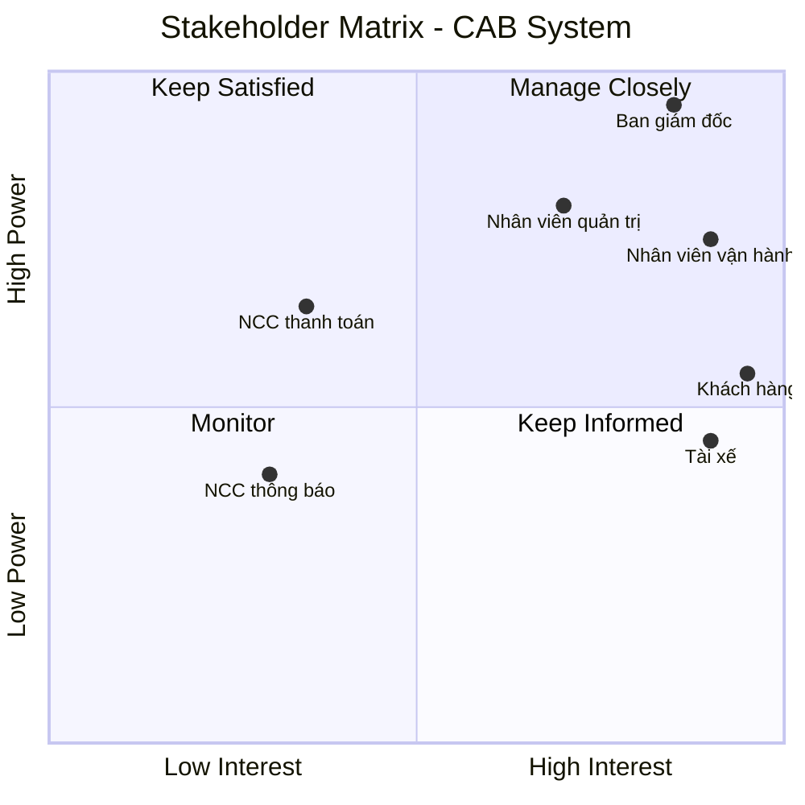

# Stakeholders
| Stakeholder | Vai trò |
|---|---|
| **Ban giám đốc Công ty ABC** | Định hướng mục tiêu kinh doanh, đưa ra kỳ vọng đối với hệ thống và theo dõi các chỉ số hoạt động như số lượng chuyến, doanh thu, tỷ lệ hoàn thành, tỷ lệ hủy và hiệu quả của tài xế. |
| **Khách hàng** | Sử dụng hệ thống để đăng ký tài khoản, đặt xe, theo dõi chuyến đi, xem lịch sử chuyến, thanh toán và đánh giá tài xế. |
| **Tài xế** | Đăng ký hoặc được tạo tài khoản, quản lý hồ sơ và phương tiện, nhận hoặc từ chối chuyến, cập nhật trạng thái chuyến và cung cấp thông tin vị trí. |
| **Nhân viên vận hành** | Quản lý khách hàng, tài xế, phương tiện và chuyến đi; theo dõi các chuyến đang diễn ra, kiểm tra trạng thái tài xế và hỗ trợ xử lý các trường hợp chuyến bị lỗi. |
| **Nhân viên quản trị có quyền cao** | Thực hiện các chức năng quản trị nhạy cảm theo quyền được phân công; các thao tác quản trị phải được kiểm soát quyền truy cập. |
| **Nhà cung cấp dịch vụ thanh toán** | Cung cấp dịch vụ xử lý thanh toán điện tử cho hệ thống CAB; hệ thống CAB không lưu trực tiếp thông tin nhạy cảm của thẻ hoặc tài khoản thanh toán. |
| **Nhà cung cấp dịch vụ thông báo** | Cung cấp các kênh gửi thông báo đến khách hàng và tài xế về trạng thái đặt xe, chuyến đi và thanh toán. |

# Business Goals
| ID | Business Goal | Mô tả |
|---|---|---|
| BG1 | Xây dựng nền tảng CAB có khả năng mở rộng | Xây dựng hệ thống có khả năng phục vụ số lượng lớn khách hàng và tài xế, đồng thời dễ dàng mở rộng thêm tính năng, dịch vụ và thành phần kỹ thuật trong tương lai. |
| BG2 | Tự động hóa quy trình tìm và phân công tài xế | Tự động xác định và ưu tiên tài xế phù hợp, gần khách hàng; tiếp tục tìm tài xế khác khi tài xế được đề xuất không phản hồi hoặc từ chối chuyến. |
| BG3 | Nâng cao trải nghiệm khách hàng | Giúp khách hàng thuận tiện trong việc đặt xe, theo dõi trạng thái chuyến đi, xem thông tin tài xế, thời gian dự kiến đến, lịch sử chuyến, thanh toán và đánh giá tài xế. |
| BG4 | Nâng cao hiệu quả quản lý và vận hành | Cung cấp giao diện quản trị để quản lý khách hàng, tài xế, phương tiện và chuyến đi; theo dõi chuyến đang diễn ra và hỗ trợ xử lý các trường hợp lỗi. |
| BG5 | Quản lý thanh toán và doanh thu hiệu quả | Hỗ trợ tính cước, thanh toán tiền mặt và điện tử, tích hợp với nhà cung cấp thanh toán bên ngoài và quản lý thông tin giao dịch tập trung. |
| BG6 | Đảm bảo hệ thống ổn định, bảo mật và liên tục | Đảm bảo hệ thống hoạt động ổn định khi nhu cầu tăng cao, các thành phần có thể mở rộng độc lập, đồng thời bảo vệ dữ liệu và kiểm soát quyền truy cập. |
| BG7 | Hỗ trợ quản lý và ra quyết định dựa trên dữ liệu | Cung cấp báo cáo về số lượng chuyến, doanh thu, tỷ lệ hoàn thành, tỷ lệ hủy và hiệu quả hoạt động của tài xế. |

# MVP Modules

| STT | Module | Mô tả | Chức năng chính |
|---|---|---|---|
| 1 | **Quản lý tài khoản & xác thực** | Quản lý tài khoản và xác thực người dùng. | Đăng ký, đăng nhập, cập nhật thông tin cá nhân, xác thực tài khoản. |
| 2 | **Quản lý khách hàng** | Quản lý thông tin và dữ liệu liên quan đến khách hàng. | Quản lý thông tin cá nhân, xem lịch sử chuyến đi, xem thông tin thanh toán liên quan. |
| 3 | **Quản lý tài xế & phương tiện** | Quản lý hồ sơ tài xế, phương tiện và trạng thái hoạt động. | Đăng ký/tạo tài khoản tài xế, cập nhật hồ sơ, quản lý phương tiện, cập nhật trạng thái sẵn sàng nhận chuyến. |
| 4 | **Đặt xe** | Cho phép khách hàng tạo yêu cầu đặt xe. | Nhập điểm đón, điểm đến, chọn loại xe, gửi yêu cầu đặt xe. |
| 5 | **Tìm kiếm & phân công tài xế** | Tự động tìm tài xế phù hợp với yêu cầu của khách hàng. | Xác định tài xế dựa trên vị trí, trạng thái sẵn sàng và tiêu chí vận hành; ưu tiên tài xế phù hợp và gần khách hàng; tìm tài xế khác khi tài xế từ chối hoặc không phản hồi. |
| 6 | **Quản lý chuyến đi** | Quản lý toàn bộ trạng thái của chuyến từ lúc đặt đến khi hoàn thành. | Theo dõi trạng thái tìm tài xế, tài xế nhận chuyến, tài xế đến điểm đón, đã đón khách, đang di chuyển và hoàn thành chuyến. |
| 7 | **Tính cước & thanh toán** | Tính số tiền khách hàng phải trả và xử lý thanh toán. | Tính cước, thanh toán tiền mặt, thanh toán điện tử, ghi nhận kết quả giao dịch, xử lý giao dịch thất bại. |
| 8 | **Thông báo** | Gửi thông tin cập nhật đến khách hàng và tài xế. | Thông báo tiếp nhận yêu cầu, tài xế nhận chuyến, tài xế đến điểm đón, hoàn thành chuyến và kết quả thanh toán; thông báo chuyến mới hoặc thay đổi cho tài xế. |
| 9 | **Quản lý vận hành** | Hỗ trợ nhân viên vận hành theo dõi và quản lý hoạt động của hệ thống. | Quản lý khách hàng, tài xế, phương tiện, chuyến đi; xem chuyến đang diễn ra; kiểm tra trạng thái tài xế; xử lý các trường hợp chuyến bị lỗi; tra cứu lịch sử giao dịch. |
| 10 | **Quản lý đánh giá** | Thu thập đánh giá của khách hàng sau chuyến đi. | Cho phép khách hàng đánh giá tài xế sau khi hoàn thành chuyến. |
| 11 | **Báo cáo cơ bản** | Cung cấp dữ liệu phục vụ theo dõi hoạt động kinh doanh. | Báo cáo số lượng chuyến, doanh thu, tỷ lệ chuyến hoàn thành, tỷ lệ hủy và hiệu quả hoạt động của tài xế. |

# Business Requirements
| ID | Business Requirement | Mô tả |
|---|---|---|
| BR01 | **Xây dựng nền tảng đặt xe trực tuyến** | Xây dựng một nền tảng CAB mới thay thế/khắc phục các hạn chế của hệ thống hiện tại, hỗ trợ khách hàng và tài xế thực hiện quy trình đặt và thực hiện chuyến xe trên cùng một hệ thống. |
| BR02 | **Hỗ trợ số lượng lớn người dùng** | Hệ thống phải có khả năng phục vụ số lượng lớn khách hàng và tài xế, đồng thời có khả năng mở rộng khi nhu cầu sử dụng tăng. |
| BR03 | **Tự động hóa việc tìm và phân công tài xế** | Hệ thống phải tự động tìm và ưu tiên tài xế phù hợp dựa trên vị trí, trạng thái sẵn sàng và các tiêu chí vận hành; đồng thời có khả năng tiếp tục tìm tài xế khác khi tài xế không phản hồi hoặc từ chối chuyến. |
| BR04 | **Quản lý toàn bộ quy trình chuyến xe** | Hệ thống phải hỗ trợ và theo dõi toàn bộ quy trình từ khi khách hàng tạo yêu cầu đặt xe, tìm tài xế, thực hiện chuyến đến khi chuyến hoàn thành. |
| BR05 | **Cung cấp khả năng theo dõi chuyến đi** | Hệ thống phải cho phép khách hàng theo dõi trạng thái chuyến đi, thông tin tài xế và thời gian dự kiến tài xế đến. |
| BR06 | **Hỗ trợ tính cước và thanh toán** | Hệ thống phải tính số tiền khách hàng cần thanh toán và hỗ trợ cả thanh toán tiền mặt và thanh toán điện tử thông qua nhà cung cấp dịch vụ thanh toán bên ngoài. |
| BR07 | **Quản lý thông báo** | Hệ thống phải cung cấp thông báo cho khách hàng và tài xế về các sự kiện quan trọng trong quá trình đặt và thực hiện chuyến cũng như kết quả thanh toán. |
| BR08 | **Hỗ trợ quản lý và vận hành tập trung** | Hệ thống phải cung cấp giao diện quản trị để nhân viên vận hành quản lý khách hàng, tài xế, phương tiện và chuyến đi, đồng thời theo dõi và xử lý các trường hợp bất thường. |
| BR09 | **Cung cấp báo cáo hoạt động** | Hệ thống phải cung cấp dữ liệu và báo cáo phục vụ quản lý, bao gồm số lượng chuyến, doanh thu, tỷ lệ hoàn thành, tỷ lệ hủy và hiệu quả hoạt động của tài xế. |
| BR10 | **Đảm bảo tính ổn định và khả năng mở rộng** | Hệ thống phải hoạt động ổn định khi nhu cầu tăng cao, các thành phần có thể mở rộng độc lập và lỗi tại một thành phần như thanh toán hoặc thông báo không làm toàn bộ hệ thống dừng hoạt động. |
| BR11 | **Đảm bảo an toàn và bảo mật dữ liệu** | Hệ thống phải xác thực người dùng, kiểm soát quyền truy cập đối với các chức năng quản trị, bảo vệ dữ liệu cá nhân, dữ liệu vị trí và dữ liệu giao dịch, đồng thời lưu vết các thao tác quan trọng. |
| BR12 | **Hỗ trợ phát triển và mở rộng trong tương lai** | Hệ thống phải có kiến trúc linh hoạt để có thể bổ sung loại dịch vụ, phương thức thanh toán, nhà cung cấp thông báo và thay đổi các thành phần kỹ thuật mà không phải xây dựng lại toàn bộ hệ thống. |
