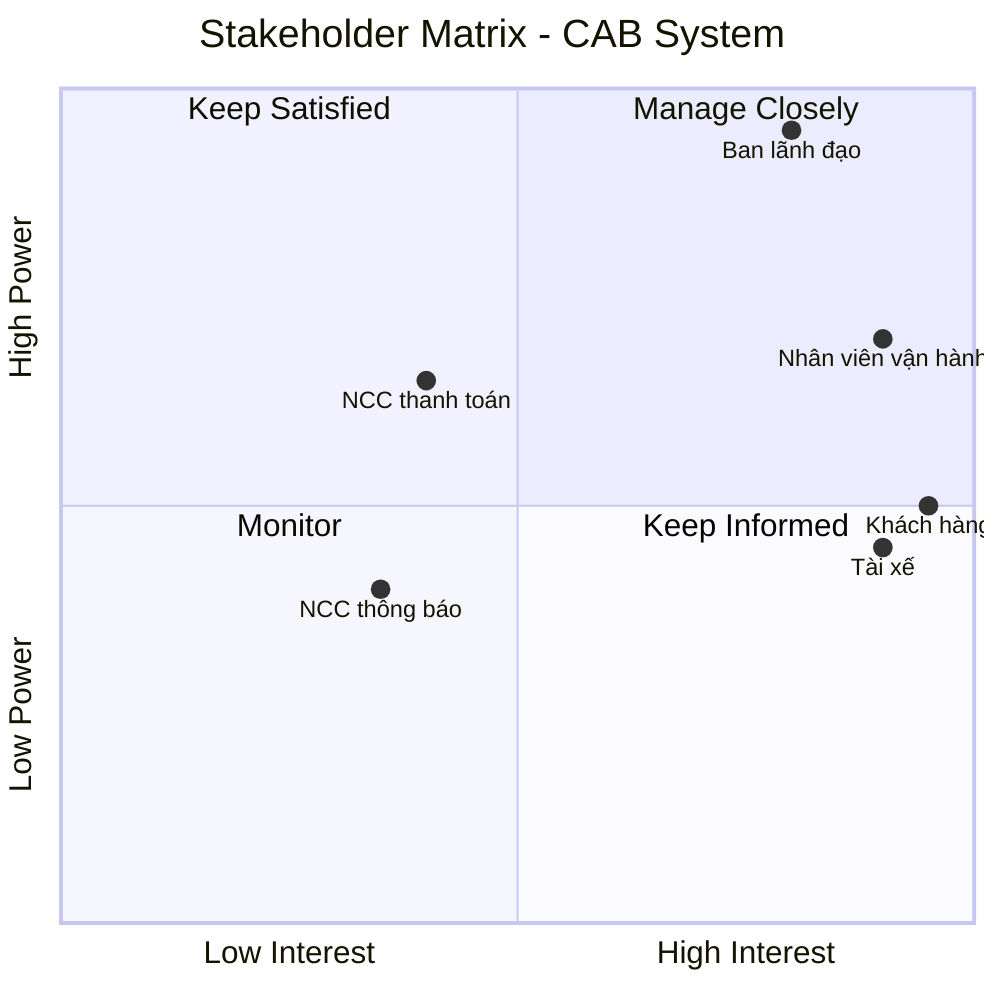
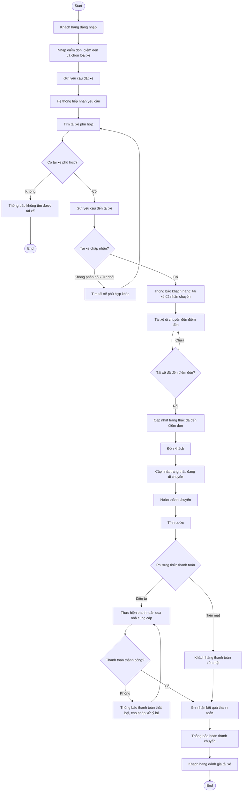
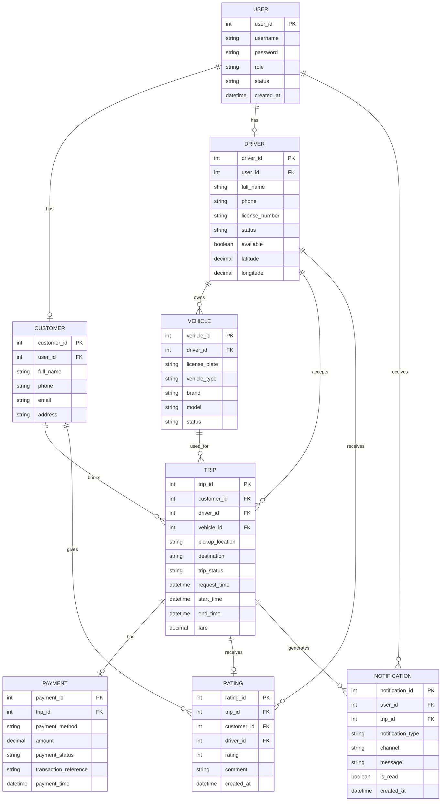
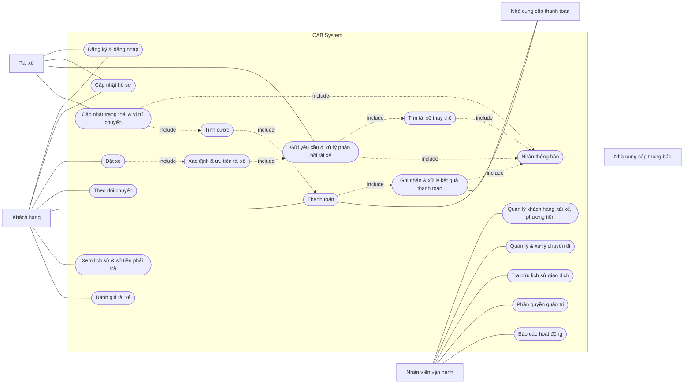

# SOFTWARE REQUIREMENTS SPECIFICATION
## Dự án: CAB System — Nền tảng đặt xe (Công ty ABC)

---

# 1. Stakeholders

| Stakeholder | Vai trò |
|---|---|
| **Ban lãnh đạo Công ty ABC** | Định hướng mục tiêu kinh doanh, đưa ra kỳ vọng đối với hệ thống mới và theo dõi các chỉ số hoạt động (số lượng chuyến, doanh thu, tỷ lệ hoàn thành, tỷ lệ hủy, hiệu quả tài xế). |
| **Khách hàng** | Đăng ký tài khoản, đặt xe, theo dõi chuyến đi, xem lịch sử, thanh toán và đánh giá tài xế. |
| **Tài xế** | Đăng ký hoặc được vận hành tạo tài khoản, quản lý hồ sơ và phương tiện, nhận/từ chối chuyến, cập nhật trạng thái chuyến và vị trí. |
| **Nhân viên vận hành** | Quản lý khách hàng, tài xế, phương tiện, chuyến đi; theo dõi chuyến đang diễn ra; xử lý chuyến bị lỗi; tra cứu lịch sử giao dịch. Một số thao tác nhạy cảm chỉ dành cho nhân viên được phân quyền phù hợp. |
| **Nhà cung cấp dịch vụ thanh toán** | Xử lý thanh toán điện tử cho hệ thống; hệ thống CAB không lưu trực tiếp thông tin nhạy cảm của thẻ/tài khoản thanh toán. |
| **Nhà cung cấp dịch vụ thông báo** | Cung cấp kênh gửi thông báo đến khách hàng và tài xế; hệ thống cần dễ dàng bổ sung kênh thông báo mới trong tương lai. |

---

# 2. Stakeholder Matrix

Ma trận dưới đây đánh giá mức độ quan tâm (Interest) và mức độ ảnh hưởng (Power) của từng stakeholder đối với dự án, làm cơ sở xác định cách thức trao đổi và mức độ ưu tiên khi thu thập/xác nhận yêu cầu.

```mermaid
quadrantChart
    title Stakeholder Matrix - CAB System
    x-axis Low Interest --> High Interest
    y-axis Low Power --> High Power

    quadrant-1 Manage Closely
    quadrant-2 Keep Satisfied
    quadrant-3 Monitor
    quadrant-4 Keep Informed

    "Ban lãnh đạo": [0.80, 0.95]
    "Nhân viên vận hành": [0.90, 0.70]
    "Khách hàng": [0.95, 0.50]
    "Tài xế": [0.90, 0.45]
    "NCC thanh toán": [0.40, 0.65]
    "NCC thông báo": [0.35, 0.40]
```

| Stakeholder | Quadrant | Cách tiếp cận |
|---|---|---|
| Ban lãnh đạo | Manage Closely | Trao đổi thường xuyên, xác nhận mục tiêu kinh doanh và các chỉ số báo cáo. |
| Nhân viên vận hành | Manage Closely | Thu thập chi tiết nghiệp vụ vận hành hằng ngày, xác nhận quy trình xử lý ngoại lệ. |
| Khách hàng | Keep Informed | Thu thập kỳ vọng trải nghiệm sử dụng, thông báo tiến độ khi cần. |
| Tài xế | Keep Informed | Thu thập kỳ vọng về quy trình nhận chuyến và cập nhật trạng thái. |
| Nhà cung cấp thanh toán | Keep Satisfied | Xác nhận chuẩn tích hợp và yêu cầu bảo mật giao dịch. |
| Nhà cung cấp thông báo | Monitor | Xác nhận các kênh thông báo hỗ trợ và khả năng mở rộng. |

---

# 3. Business Goals

| ID | Business Goal | Mô tả |
|---|---|---|
| BG1 | Xây dựng nền tảng có khả năng mở rộng | Phục vụ số lượng lớn khách hàng và tài xế, dễ dàng bổ sung tính năng, dịch vụ và thành phần kỹ thuật trong tương lai mà không phải xây lại toàn bộ hệ thống. |
| BG2 | Tự động hóa việc tìm và phân công tài xế | Tự động xác định, ưu tiên tài xế phù hợp và gần khách hàng; tự động tìm tài xế khác khi tài xế được đề xuất không phản hồi hoặc từ chối. |
| BG3 | Nâng cao trải nghiệm khách hàng | Giúp khách hàng đặt xe thuận tiện, theo dõi chuyến đi theo thời gian thực, xem thông tin tài xế/ETA, lịch sử chuyến, số tiền phải trả và đánh giá tài xế. |
| BG4 | Nâng cao hiệu quả quản lý và vận hành | Cung cấp giao diện quản trị để nhân viên vận hành quản lý khách hàng, tài xế, phương tiện, chuyến đi và xử lý các trường hợp bất thường. |
| BG5 | Quản lý thanh toán và doanh thu hiệu quả | Hỗ trợ tính cước, thanh toán tiền mặt và điện tử qua nhà cung cấp bên ngoài, đảm bảo an toàn thông tin thanh toán. |
| BG6 | Đảm bảo hệ thống ổn định, an toàn và liên tục | Hệ thống hoạt động ổn định khi tải cao, các thành phần mở rộng độc lập, lỗi cục bộ không ảnh hưởng toàn hệ thống, dữ liệu được bảo vệ và kiểm soát truy cập. |
| BG7 | Hỗ trợ ra quyết định dựa trên dữ liệu | Cung cấp báo cáo về số lượng chuyến, doanh thu, tỷ lệ hoàn thành, tỷ lệ hủy và hiệu quả hoạt động của tài xế. |

---

# 4. MVP Modules

| STT | Module | Mô tả | Chức năng chính |
|---|---|---|---|
| 1 | **Quản lý tài khoản & xác thực** | Quản lý tài khoản và xác thực người dùng. | Đăng ký, đăng nhập, cập nhật thông tin cá nhân. |
| 2 | **Quản lý tài xế & phương tiện** | Quản lý hồ sơ tài xế, phương tiện và trạng thái hoạt động. | Đăng ký/tạo tài khoản tài xế, cập nhật hồ sơ và phương tiện, cập nhật trạng thái sẵn sàng nhận chuyến. |
| 3 | **Đặt xe** | Cho phép khách hàng tạo yêu cầu đặt xe. | Nhập điểm đón/điểm đến, chọn loại xe, gửi yêu cầu đặt xe. |
| 4 | **Tìm kiếm & phân công tài xế** | Tự động tìm tài xế phù hợp với yêu cầu của khách hàng. | Xác định tài xế theo vị trí, trạng thái sẵn sàng và tiêu chí vận hành; ưu tiên tài xế phù hợp và gần khách hàng; tìm tài xế khác khi bị từ chối hoặc không phản hồi. |
| 5 | **Quản lý chuyến đi** | Quản lý toàn bộ trạng thái chuyến từ lúc đặt đến khi hoàn thành. | Cập nhật trạng thái chuyến, cập nhật vị trí tài xế, theo dõi chuyến, hiển thị thông tin tài xế và thời gian dự kiến đến. |
| 6 | **Tính cước & thanh toán** | Tính số tiền khách hàng phải trả và xử lý thanh toán. | Tính cước, thanh toán tiền mặt, thanh toán điện tử, ghi nhận kết quả giao dịch, xử lý thanh toán thất bại. |
| 7 | **Thông báo** | Gửi thông tin cập nhật đến khách hàng và tài xế. | Thông báo các sự kiện của chuyến đi (tiếp nhận yêu cầu, tài xế nhận chuyến, đến điểm đón, hoàn thành, kết quả thanh toán) và chuyến mới/thay đổi cho tài xế. |
| 8 | **Lịch sử & đánh giá** | Cho phép khách hàng xem lại thông tin chuyến và đánh giá tài xế. | Xem lịch sử chuyến, xem số tiền phải trả, đánh giá tài xế sau khi hoàn thành chuyến. |
| 9 | **Quản lý vận hành** | Hỗ trợ nhân viên vận hành theo dõi và quản lý hoạt động hệ thống. | Quản lý khách hàng, tài xế, phương tiện, chuyến đi; xem chuyến đang diễn ra; kiểm tra trạng thái tài xế; xử lý chuyến bị lỗi; tra cứu lịch sử giao dịch; phân quyền quản trị. |
| 10 | **Báo cáo cơ bản** | Cung cấp dữ liệu phục vụ theo dõi hoạt động kinh doanh. | Báo cáo số lượng chuyến, doanh thu, tỷ lệ hoàn thành, tỷ lệ hủy và hiệu quả hoạt động của tài xế. |

---

# 5. Business Requirements

| ID | Business Requirement | Mô tả |
|---|---|---|
| BR01 | Xây dựng nền tảng đặt xe trực tuyến | Thay thế hệ thống hiện tại, cho phép khách hàng và tài xế thực hiện toàn bộ quy trình đặt và thực hiện chuyến trên cùng một nền tảng. |
| BR02 | Hỗ trợ số lượng lớn người dùng | Phục vụ số lượng lớn khách hàng và tài xế, có khả năng mở rộng khi nhu cầu sử dụng tăng. |
| BR03 | Tự động hóa việc tìm và phân công tài xế | Tự động tìm và ưu tiên tài xế phù hợp dựa trên vị trí, trạng thái sẵn sàng và tiêu chí vận hành; tiếp tục tìm tài xế khác khi tài xế không phản hồi hoặc từ chối chuyến. |
| BR04 | Quản lý toàn bộ quy trình chuyến xe | Theo dõi toàn bộ quy trình từ khi khách hàng tạo yêu cầu đến khi chuyến hoàn thành và được đánh giá. |
| BR05 | Cung cấp khả năng theo dõi chuyến đi | Cho phép khách hàng theo dõi trạng thái chuyến, thông tin tài xế, thời gian dự kiến đến, lịch sử chuyến và số tiền phải trả. |
| BR06 | Hỗ trợ tính cước và thanh toán | Tính số tiền khách hàng phải trả; hỗ trợ thanh toán tiền mặt và điện tử qua nhà cung cấp bên ngoài, không lưu trực tiếp thông tin thanh toán nhạy cảm. |
| BR07 | Quản lý thông báo | Thông báo cho khách hàng và tài xế về các sự kiện quan trọng trong quá trình đặt, thực hiện chuyến và kết quả thanh toán. |
| BR08 | Hỗ trợ quản lý và vận hành tập trung | Cung cấp giao diện quản trị để nhân viên vận hành quản lý khách hàng, tài xế, phương tiện, chuyến đi và xử lý các trường hợp bất thường. |
| BR09 | Cung cấp báo cáo hoạt động | Cung cấp dữ liệu và báo cáo về số lượng chuyến, doanh thu, tỷ lệ hoàn thành, tỷ lệ hủy và hiệu quả hoạt động của tài xế. |
| BR10 | Đảm bảo tính ổn định và khả năng mở rộng | Hoạt động ổn định khi nhu cầu tăng cao; các thành phần mở rộng độc lập; lỗi tại một thành phần (thanh toán/thông báo) không làm dừng toàn bộ hệ thống. |
| BR11 | Đảm bảo an toàn và bảo mật dữ liệu | Xác thực người dùng, kiểm soát quyền truy cập với chức năng quản trị, bảo vệ dữ liệu cá nhân/vị trí/giao dịch, lưu vết các thao tác quan trọng. |
| BR12 | Hỗ trợ phát triển và mở rộng trong tương lai | Kiến trúc linh hoạt để bổ sung loại dịch vụ, phương thức thanh toán, nhà cung cấp thông báo hoặc thay đổi thành phần kỹ thuật mà không phải xây lại toàn bộ hệ thống. |

**Liên kết Business Goals ↔ Business Requirements**

| BG | BR liên quan |
|---|---|
| BG1 | BR01, BR02, BR12 |
| BG2 | BR03 |
| BG3 | BR04, BR05, BR07 |
| BG4 | BR08 |
| BG5 | BR06 |
| BG6 | BR10, BR11 |
| BG7 | BR09 |

---

# 6. Business Process Modeling

## 6.1. Business Process Overview

Quy trình nghiệp vụ cốt lõi của hệ thống CAB — vòng đời một chuyến xe — gồm các bước:

**Tạo yêu cầu đặt xe → Tìm kiếm và phân công tài xế → Xác nhận chuyến → Thực hiện chuyến → Tính cước → Thanh toán → Hoàn tất chuyến → Đánh giá**

Đây là quy trình duy nhất được mô hình hóa chi tiết vì đây là quy trình trung tâm, xuyên suốt các module của hệ thống. Các nhóm chức năng còn lại (quản lý tài khoản, quản lý vận hành, báo cáo) là các chức năng hỗ trợ, không phải quy trình tuần tự nhiều bước.

## 6.2. Business Process Diagram

```mermaid
flowchart TD

    A([Start]) --> B[Khách hàng đăng nhập]
    B --> C[Nhập điểm đón, điểm đến và chọn loại xe]
    C --> D[Gửi yêu cầu đặt xe]

    D --> E[Hệ thống tiếp nhận yêu cầu]
    E --> F[Tìm tài xế phù hợp]

    F --> G{Có tài xế phù hợp?}

    G -- Không --> H[Thông báo không tìm được tài xế]
    H --> Z([End])

    G -- Có --> I[Gửi yêu cầu đến tài xế]
    I --> J{Tài xế chấp nhận?}

    J -- Không phản hồi / Từ chối --> K[Tìm tài xế phù hợp khác]
    K --> F

    J -- Có --> L[Thông báo khách hàng: tài xế đã nhận chuyến]
    L --> M[Tài xế di chuyển đến điểm đón]

    M --> N{Tài xế đã đến điểm đón?}
    N -- Chưa --> M
    N -- Rồi --> O[Cập nhật trạng thái: đã đến điểm đón]

    O --> P[Đón khách]
    P --> Q[Cập nhật trạng thái: đang di chuyển]
    Q --> R[Hoàn thành chuyến]

    R --> S[Tính cước]
    S --> T{Phương thức thanh toán}

    T -- Tiền mặt --> U[Khách hàng thanh toán tiền mặt]
    T -- Điện tử --> V[Thực hiện thanh toán qua nhà cung cấp]

    V --> W{Thanh toán thành công?}
    W -- Không --> X[Thông báo thanh toán thất bại, cho phép xử lý lại]
    X --> V
    W -- Có --> Y[Ghi nhận kết quả thanh toán]

    U --> Y
    Y --> AA[Thông báo hoàn thành chuyến]
    AA --> AB[Khách hàng đánh giá tài xế]
    AB --> AC([End])
```

## 6.3. Các bên tham gia trong Business Process

| Actor / Stakeholder | Vai trò trong quy trình |
|---|---|
| **Khách hàng** | Tạo yêu cầu đặt xe, theo dõi chuyến, thanh toán, đánh giá tài xế. |
| **Hệ thống CAB** | Tiếp nhận yêu cầu, tìm và phân công tài xế, quản lý trạng thái chuyến, tính cước, xử lý thanh toán, gửi thông báo. |
| **Tài xế** | Nhận/từ chối chuyến, di chuyển đến điểm đón, đón khách, cập nhật trạng thái, hoàn thành chuyến. |
| **Nhà cung cấp thanh toán** | Xử lý giao dịch thanh toán điện tử, trả về kết quả giao dịch. |
| **Nhân viên vận hành** | Theo dõi chuyến đang diễn ra, kiểm tra trạng thái tài xế, hỗ trợ xử lý chuyến bị lỗi (nằm ngoài luồng chính, can thiệp khi có sự cố). |

## 6.4. Business Process theo Business Requirement

| Business Requirement | Bước quy trình liên quan |
|---|---|
| BR01 – Nền tảng đặt xe trực tuyến | Toàn bộ quy trình đặt và thực hiện chuyến |
| BR03 – Tự động hóa tìm và phân công tài xế | Tìm tài xế → Kiểm tra phản hồi → Tìm tài xế khác khi cần |
| BR04 – Quản lý toàn bộ quy trình chuyến xe | Từ tạo yêu cầu đến hoàn thành chuyến |
| BR05 – Theo dõi chuyến đi | Cập nhật và thông báo trạng thái chuyến |
| BR06 – Tính cước và thanh toán | Tính cước → Thanh toán → Xử lý kết quả giao dịch |
| BR07 – Quản lý thông báo | Thông báo xuyên suốt các bước của quy trình |
| BR11 – Bảo mật dữ liệu | Đăng nhập/xác thực trước khi khách hàng tạo yêu cầu |

---

# 7. Functional Requirements

> Đã rà soát và gộp các chức năng nhỏ lẻ, liên quan chặt chẽ với nhau vào cùng một FR (ví dụ: các bước nhập liệu/gửi yêu cầu trong cùng một thao tác nghiệp vụ, các thao tác CRUD cùng nhóm đối tượng của nhân viên vận hành) để giữ lại **19 yêu cầu chức năng cốt lõi**, phản ánh đúng và đủ nghiệp vụ trong đề bài mà không rời rạc hóa quá mức.

| ID | Module | Functional Requirement | Mô tả |
|---|---|---|---|
| FR01 | Quản lý tài khoản & xác thực | Đăng ký & đăng nhập | Hệ thống cho phép khách hàng đăng ký tài khoản, tài xế tự đăng ký hoặc được nhân viên vận hành tạo tài khoản; khách hàng và tài xế đăng nhập trước khi sử dụng chức năng yêu cầu tài khoản. |
| FR02 | Quản lý tài khoản & xác thực | Cập nhật hồ sơ | Hệ thống cho phép khách hàng cập nhật thông tin cá nhân; tài xế cập nhật hồ sơ, thông tin phương tiện và trạng thái sẵn sàng nhận chuyến. |
| FR03 | Đặt xe | Tạo yêu cầu đặt xe | Hệ thống cho phép khách hàng nhập điểm đón, điểm đến, chọn loại xe và gửi yêu cầu đặt xe; hệ thống tiếp nhận và ghi nhận yêu cầu. |
| FR04 | Tìm kiếm & phân công tài xế | Xác định & ưu tiên tài xế phù hợp | Hệ thống xác định các tài xế phù hợp dựa trên vị trí, trạng thái sẵn sàng và tiêu chí vận hành, đồng thời ưu tiên tài xế phù hợp và gần khách hàng. |
| FR05 | Tìm kiếm & phân công tài xế | Gửi yêu cầu & xử lý phản hồi tài xế | Hệ thống gửi yêu cầu chuyến đến tài xế phù hợp và ghi nhận việc tài xế chấp nhận hoặc từ chối. |
| FR06 | Tìm kiếm & phân công tài xế | Tìm tài xế thay thế | Khi tài xế không phản hồi hoặc từ chối, hệ thống tự động tìm tài xế khác mà không yêu cầu khách hàng tạo lại yêu cầu; nếu không còn tài xế phù hợp, hệ thống thông báo rõ ràng cho khách hàng. |
| FR07 | Quản lý chuyến đi | Cập nhật trạng thái & vị trí chuyến | Hệ thống cho phép tài xế cập nhật trạng thái chuyến (đã đến điểm đón, đã đón khách, đang di chuyển, hoàn thành) và cập nhật vị trí trong suốt quá trình thực hiện chuyến. |
| FR08 | Quản lý chuyến đi | Theo dõi chuyến | Hệ thống cho phép khách hàng theo dõi trạng thái hiện tại của chuyến, thông tin tài xế đã nhận chuyến và thời gian dự kiến đến. |
| FR09 | Tính cước & thanh toán | Tính cước | Hệ thống xác định số tiền khách hàng phải trả dựa trên loại dịch vụ và thông tin chuyến đi. |
| FR10 | Tính cước & thanh toán | Thanh toán | Hệ thống hỗ trợ khách hàng thanh toán bằng tiền mặt hoặc thanh toán điện tử thông qua nhà cung cấp thanh toán bên ngoài. |
| FR11 | Tính cước & thanh toán | Ghi nhận & xử lý kết quả thanh toán | Hệ thống ghi nhận kết quả giao dịch thanh toán; khi thanh toán điện tử thất bại, hệ thống thông báo cho khách hàng và cho phép xử lý lại theo chính sách doanh nghiệp. |
| FR12 | Thông báo | Gửi thông báo | Hệ thống gửi thông báo cho khách hàng (tiếp nhận yêu cầu, tài xế nhận chuyến, tài xế đến điểm đón, hoàn thành chuyến, kết quả thanh toán, không tìm được tài xế) và cho tài xế (chuyến mới hoặc thay đổi liên quan đến chuyến đang thực hiện). |
| FR13 | Lịch sử & đánh giá | Xem lịch sử & số tiền phải trả | Hệ thống cho phép khách hàng xem lịch sử các chuyến đã thực hiện và số tiền phải trả cho từng chuyến. |
| FR14 | Lịch sử & đánh giá | Đánh giá tài xế | Hệ thống cho phép khách hàng đánh giá tài xế sau khi chuyến hoàn thành. |
| FR15 | Quản lý vận hành | Quản lý khách hàng, tài xế, phương tiện | Nhân viên vận hành xem và quản lý thông tin khách hàng, tài xế và phương tiện. |
| FR16 | Quản lý vận hành | Quản lý & xử lý chuyến đi | Nhân viên vận hành xem, quản lý thông tin chuyến đi, theo dõi các chuyến đang diễn ra, kiểm tra trạng thái tài xế liên quan và hỗ trợ xử lý chuyến gặp sự cố. |
| FR17 | Quản lý vận hành | Tra cứu lịch sử giao dịch | Nhân viên vận hành tra cứu lịch sử giao dịch của chuyến đi. |
| FR18 | Quản lý vận hành | Phân quyền quản trị | Hệ thống kiểm soát quyền truy cập để chỉ nhân viên được phân quyền phù hợp mới thực hiện được các thao tác quản trị nhạy cảm. |
| FR19 | Báo cáo cơ bản | Báo cáo hoạt động | Hệ thống cung cấp báo cáo về số lượng chuyến, doanh thu, tỷ lệ hoàn thành, tỷ lệ hủy và hiệu quả hoạt động của tài xế. |

---

# 8. Non-Functional Requirements

| ID | Category | Non-Functional Requirement | Mô tả |
|---|---|---|---|
| NFR01 | Performance | Đáp ứng tốt khi nhu cầu tăng cao | Hệ thống duy trì khả năng hoạt động ổn định khi số lượng khách hàng, tài xế và yêu cầu đặt xe tăng lên. |
| NFR02 | Scalability | Mở rộng độc lập theo thành phần | Các thành phần của hệ thống có thể mở rộng độc lập khi tải tăng, không cần mở rộng toàn bộ hệ thống. |
| NFR03 | Availability | Duy trì hoạt động khi một thành phần gặp lỗi | Lỗi tại chức năng thanh toán hoặc thông báo không được làm toàn bộ hệ thống đặt xe ngừng hoạt động. |
| NFR04 | Reliability | Hoạt động ổn định xuyên suốt quy trình | Hệ thống đảm bảo hoạt động ổn định trong quá trình đặt xe, tìm tài xế, thực hiện chuyến, thanh toán và thông báo. |
| NFR05 | Security | Xác thực người dùng | Khách hàng và tài xế phải được xác thực trước khi sử dụng các chức năng yêu cầu tài khoản. |
| NFR06 | Authorization | Kiểm soát quyền truy cập | Các chức năng quản trị phải được phân quyền để nhân viên không có quyền không thể thực hiện các thao tác nhạy cảm. |
| NFR07 | Data Security | Bảo vệ dữ liệu | Thông tin cá nhân, thông tin phương tiện, dữ liệu vị trí và dữ liệu giao dịch phải được bảo vệ. |
| NFR08 | Payment Security | Không lưu trực tiếp thông tin thanh toán nhạy cảm | Thông tin nhạy cảm của thẻ hoặc tài khoản thanh toán không được lưu trực tiếp trong hệ thống CAB. |
| NFR09 | Auditability | Lưu vết các thao tác quan trọng | Các thao tác quan trọng phải được ghi nhận để phục vụ kiểm tra khi có sự cố. |
| NFR10 | Maintainability | Triển khai chức năng từng phần | Các chức năng mới có thể được triển khai từng phần, hạn chế ảnh hưởng đến các chức năng đang hoạt động. |
| NFR11 | Extensibility | Linh hoạt mở rộng trong tương lai | Có thể bổ sung loại dịch vụ mới, phương thức thanh toán mới hoặc nhà cung cấp thông báo mới mà không phải xây dựng lại toàn bộ ứng dụng. |
| NFR12 | Modularity | Thay đổi thành phần kỹ thuật độc lập | Có thể thay đổi một số thành phần kỹ thuật, hạn chế ảnh hưởng đến toàn bộ hệ thống. |

---

# 9. Business Rules

Các quy tắc nghiệp vụ dưới đây là ràng buộc/điều kiện bắt buộc hệ thống phải tuân theo, được rút ra trực tiếp từ mô tả nghiệp vụ trong đề bài. Đây là cơ sở để thiết kế logic xử lý cho các Functional Requirement tương ứng.

| ID | Business Rule | Áp dụng cho | FR/NFR liên quan |
|---|---|---|---|
| RL01 | Hệ thống chỉ gửi yêu cầu chuyến cho tài xế đang ở trạng thái sẵn sàng (available) và phù hợp với vị trí/tiêu chí vận hành. | Tìm kiếm & phân công tài xế | FR04 |
| RL02 | Tại một thời điểm, hệ thống chỉ gửi yêu cầu chuyến đến một tài xế; nếu tài xế không phản hồi hoặc từ chối, hệ thống tự động chuyển sang tài xế phù hợp tiếp theo mà không yêu cầu khách hàng tạo lại yêu cầu. | Tìm kiếm & phân công tài xế | FR05, FR06 |
| RL03 | Khách hàng và tài xế phải được xác thực (đăng nhập) trước khi sử dụng bất kỳ chức năng nào yêu cầu tài khoản. | Toàn hệ thống | FR01, NFR05 |
| RL04 | Thông tin nhạy cảm của thẻ/tài khoản thanh toán không được lưu trực tiếp trong hệ thống CAB; giao dịch điện tử phải được xử lý qua nhà cung cấp thanh toán bên ngoài. | Tính cước & thanh toán | FR10, NFR08 |
| RL05 | Cước phí chỉ được xác định sau khi chuyến đi hoàn thành, dựa trên loại dịch vụ (loại xe) và thông tin chuyến đi. | Tính cước & thanh toán | FR09 |
| RL06 | Khách hàng chỉ được phép đánh giá tài xế sau khi chuyến đi đã hoàn thành. | Lịch sử & đánh giá | FR14 |
| RL07 | Khi thanh toán điện tử thất bại, hệ thống không được ghi nhận chuyến là đã thanh toán; phải thông báo cho khách hàng và cho phép xử lý lại theo chính sách doanh nghiệp. | Tính cước & thanh toán | FR11 |
| RL08 | Nhân viên vận hành chỉ được thực hiện thao tác quản trị nhạy cảm khi được phân quyền phù hợp với vai trò. | Quản lý vận hành | FR18, NFR06 |
| RL09 | Lỗi xảy ra ở module thanh toán hoặc thông báo không được làm gián đoạn quy trình đặt xe và thực hiện chuyến chính. | Toàn hệ thống | NFR03, NFR04 |
| RL10 | Mọi thao tác quan trọng liên quan đến tài khoản, chuyến đi, thanh toán và phân quyền quản trị phải được lưu vết (audit log) để phục vụ kiểm tra khi cần. | Toàn hệ thống | NFR09 |

---

# 10. Exception Cases & Open Questions

## 10.1. Các trường hợp ngoại lệ

| ID | Quy trình | Trường hợp ngoại lệ | Cách xử lý |
|---|---|---|---|
| EX01 | Tìm tài xế | Không tìm được tài xế phù hợp | Hệ thống thông báo rõ ràng cho khách hàng, không yêu cầu khách hàng tạo lại yêu cầu. |
| EX02 | Tìm tài xế | Tài xế được đề xuất không phản hồi | Hệ thống tiếp tục tìm tài xế phù hợp khác. |
| EX03 | Tìm tài xế | Tài xế từ chối chuyến | Hệ thống tiếp tục tìm tài xế phù hợp khác mà không yêu cầu khách hàng tạo lại yêu cầu. |
| EX04 | Thanh toán | Thanh toán điện tử thất bại | Hệ thống thông báo cho khách hàng và cho phép xử lý lại theo chính sách của doanh nghiệp. |
| EX05 | Chuyến đi | Chuyến đi xảy ra lỗi | Nhân viên vận hành kiểm tra và hỗ trợ xử lý trường hợp chuyến bị lỗi. |
| EX06 | Hệ thống | Lỗi ở chức năng thanh toán hoặc thông báo | Lỗi của một thành phần không được làm toàn bộ hệ thống đặt xe ngừng hoạt động. |
| EX07 | Bảo mật | Người dùng chưa được xác thực | Hệ thống không cho phép khách hàng hoặc tài xế sử dụng chức năng yêu cầu tài khoản khi chưa xác thực. |
| EX08 | Quản trị | Nhân viên không đủ quyền thực hiện thao tác nhạy cảm | Hệ thống kiểm soát quyền truy cập và ngăn thao tác không được phép. |

## 10.2. Theo dõi các câu hỏi từ yêu cầu gốc

Các câu hỏi dưới đây được giữ lại để truy vết nguồn yêu cầu. OQ01–OQ04 và OQ07–OQ10 đã có quyết định thiết kế cụ thể cho bài tại mục 15; chưa có xác nhận thực tế từ khách hàng. OQ05/OQ06 tiếp tục để mở vì không thuộc các giả định cần thiết của bộ test hiện tại.

| ID | Chủ đề | Điểm chưa rõ | Câu hỏi cần xác nhận |
|---|---|---|---|
| OQ01 | Tính cước | Cách tính tiền chuyến chưa được chốt. | Cước được tính dựa trên những yếu tố nào (quãng đường, thời gian, loại xe, phụ phí...)? |
| OQ02 | Ưu tiên tài xế | Tiêu chí ưu tiên tài xế chưa được xác định đầy đủ. | Hệ thống ưu tiên tài xế dựa trên khoảng cách, thời gian chờ, trạng thái hoạt động hay tiêu chí nào khác? |
| OQ03 | Phản hồi tài xế | Chưa xác định thời gian tài xế phải phản hồi yêu cầu chuyến. | Tài xế có bao nhiêu thời gian để chấp nhận/từ chối trước khi hệ thống chuyển sang tài xế khác? |
| OQ04 | Hủy chuyến | Chính sách hủy chuyến chưa được chốt. | Ai được phép hủy chuyến, ở thời điểm nào và có tính phí hủy hay không? |
| OQ05 | Mất kết nối mạng | Chưa xác định cách xử lý khi khách hàng hoặc tài xế mất kết nối. | Hệ thống xử lý trạng thái chuyến và cập nhật dữ liệu như thế nào khi mất kết nối mạng? |
| OQ06 | Lưu trữ dữ liệu | Chưa xác định thời gian lưu trữ dữ liệu. | Dữ liệu khách hàng, chuyến đi, vị trí và giao dịch được lưu trong bao lâu? |
| OQ07 | Thanh toán thất bại | Chính sách xử lý lại khi thanh toán điện tử thất bại chưa được chốt. | Khách hàng được phép thử thanh toán lại tối đa bao nhiêu lần, trong khoảng thời gian nào? |
| OQ08 | Tìm tài xế | Chưa xác định khi nào hệ thống kết luận là không tìm được tài xế. | Hệ thống tìm trong bao lâu hoặc thử tối đa bao nhiêu tài xế trước khi thông báo thất bại? |
| OQ09 | Vị trí tài xế | Chưa xác định tần suất cập nhật vị trí. | Vị trí tài xế được cập nhật với tần suất bao nhiêu và trong những trạng thái nào của chuyến? |
| OQ10 | Phân quyền quản trị | Chưa xác định chi tiết các vai trò và quyền quản trị. | Có những vai trò quản trị nào và mỗi vai trò được phép thực hiện những chức năng nào? |

---

# 11. ERD — CAB System MVP

> ERD dưới đây là mô hình dữ liệu đề xuất dựa trên các yêu cầu nghiệp vụ và chức năng đã xác định ở trên.

```mermaid
erDiagram

    USER {
        int user_id PK
        string username
        string password
        string role
        string status
        datetime created_at
    }

    CUSTOMER {
        int customer_id PK
        int user_id FK
        string full_name
        string phone
        string email
        string address
    }

    DRIVER {
        int driver_id PK
        int user_id FK
        string full_name
        string phone
        string license_number
        string status
        boolean available
        decimal latitude
        decimal longitude
    }

    VEHICLE {
        int vehicle_id PK
        int driver_id FK
        string license_plate
        string vehicle_type
        string brand
        string model
        string status
    }

    TRIP {
        int trip_id PK
        int customer_id FK
        int driver_id FK
        int vehicle_id FK
        string pickup_location
        string destination
        string trip_status
        datetime request_time
        datetime start_time
        datetime end_time
        decimal fare
    }

    PAYMENT {
        int payment_id PK
        int trip_id FK
        string payment_method
        decimal amount
        string payment_status
        string transaction_reference
        datetime payment_time
    }

    RATING {
        int rating_id PK
        int trip_id FK
        int customer_id FK
        int driver_id FK
        int rating
        string comment
        datetime created_at
    }

    NOTIFICATION {
        int notification_id PK
        int user_id FK
        int trip_id FK
        string notification_type
        string channel
        string message
        boolean is_read
        datetime created_at
    }

    USER ||--o| CUSTOMER : "has"
    USER ||--o| DRIVER : "has"

    DRIVER ||--o{ VEHICLE : "owns"

    CUSTOMER ||--o{ TRIP : "books"
    DRIVER ||--o{ TRIP : "accepts"
    VEHICLE ||--o{ TRIP : "used_for"

    TRIP ||--o| PAYMENT : "has"

    TRIP ||--o| RATING : "receives"
    CUSTOMER ||--o{ RATING : "gives"
    DRIVER ||--o{ RATING : "receives"

    USER ||--o{ NOTIFICATION : "receives"
    TRIP ||--o{ NOTIFICATION : "generates"
```

## Main Entities

| Entity | Vai trò |
|---|---|
| **USER** | Thông tin tài khoản và xác thực chung cho khách hàng và tài xế. |
| **CUSTOMER** | Thông tin khách hàng sử dụng dịch vụ đặt xe. |
| **DRIVER** | Thông tin tài xế, trạng thái hoạt động và vị trí hiện tại. |
| **VEHICLE** | Thông tin phương tiện được tài xế sử dụng. |
| **TRIP** | Thông tin yêu cầu và quá trình thực hiện chuyến xe. |
| **PAYMENT** | Thông tin thanh toán của từng chuyến đi. |
| **RATING** | Đánh giá của khách hàng dành cho tài xế sau chuyến. |
| **NOTIFICATION** | Các thông báo gửi đến khách hàng hoặc tài xế, theo kênh gửi (channel) để hỗ trợ mở rộng thêm kênh mới trong tương lai. |

---

# 12. Use Case Diagram — CAB System MVP

```mermaid
flowchart LR

    Customer["Khách hàng"]
    Driver["Tài xế"]
    Operator["Nhân viên vận hành"]
    Payment["Nhà cung cấp thanh toán"]
    Notification["Nhà cung cấp thông báo"]

    subgraph CAB["CAB System"]

        UC01(["Đăng ký & đăng nhập"])
        UC02(["Cập nhật hồ sơ"])
        UC03(["Đặt xe"])
        UC04(["Xác định & ưu tiên tài xế"])
        UC05(["Gửi yêu cầu & xử lý phản hồi tài xế"])
        UC06(["Tìm tài xế thay thế"])
        UC07(["Cập nhật trạng thái & vị trí chuyến"])
        UC08(["Theo dõi chuyến"])
        UC09(["Tính cước"])
        UC10(["Thanh toán"])
        UC11(["Ghi nhận & xử lý kết quả thanh toán"])
        UC12(["Nhận thông báo"])
        UC13(["Xem lịch sử & số tiền phải trả"])
        UC14(["Đánh giá tài xế"])

        UC15(["Quản lý khách hàng, tài xế, phương tiện"])
        UC16(["Quản lý & xử lý chuyến đi"])
        UC17(["Tra cứu lịch sử giao dịch"])
        UC18(["Phân quyền quản trị"])
        UC19(["Báo cáo hoạt động"])
    end

    Customer --- UC01
    Customer --- UC02
    Customer --- UC03
    Customer --- UC08
    Customer --- UC10
    Customer --- UC13
    Customer --- UC14

    Driver --- UC01
    Driver --- UC02
    Driver --- UC05
    Driver --- UC07

    UC03 -.->|include| UC04
    UC04 -.->|include| UC05
    UC05 -.->|include| UC06
    UC05 -.->|include| UC12
    UC06 -.->|include| UC12
    UC07 -.->|include| UC12
    UC07 -.->|include| UC09
    UC09 -.->|include| UC10
    UC10 -.->|include| UC11
    UC11 -.->|include| UC12

    UC10 --- Payment
    UC11 --- Payment
    UC12 --- Notification

    Operator --- UC15
    Operator --- UC16
    Operator --- UC17
    Operator --- UC18
    Operator --- UC19
```

---

# 13. Acceptance Criteria

| ID | Functional Requirement | Acceptance Criteria |
|---|---|---|
| AC01 | FR01 – Đăng ký & đăng nhập | Khách hàng/tài xế cung cấp đầy đủ thông tin hợp lệ thì tài khoản được tạo hoặc đăng nhập thành công; nếu thiếu/sai thông tin, hệ thống báo lỗi và từ chối truy cập. |
| AC02 | FR02 – Cập nhật hồ sơ | Khách hàng cập nhật được thông tin cá nhân; tài xế cập nhật được hồ sơ, phương tiện và trạng thái sẵn sàng; hệ thống lưu thay đổi thành công. |
| AC03 | FR03 – Tạo yêu cầu đặt xe | Khách hàng nhập đủ điểm đón, điểm đến, loại xe và gửi yêu cầu; hệ thống tiếp nhận và ghi nhận yêu cầu thành công. |
| AC04 | FR04 – Xác định & ưu tiên tài xế phù hợp | Hệ thống xác định và sắp xếp được danh sách tài xế phù hợp dựa trên vị trí, trạng thái sẵn sàng và tiêu chí vận hành. |
| AC05 | FR05 – Gửi yêu cầu & xử lý phản hồi tài xế | Hệ thống gửi được yêu cầu đến tài xế phù hợp và ghi nhận chính xác việc tài xế chấp nhận hoặc từ chối. |
| AC06 | FR06 – Tìm tài xế thay thế | Khi tài xế không phản hồi/từ chối, hệ thống tự động tìm tài xế khác mà không yêu cầu khách hàng tạo lại yêu cầu; nếu không còn tài xế phù hợp, hệ thống thông báo rõ ràng cho khách hàng. |
| AC07 | FR07 – Cập nhật trạng thái & vị trí chuyến | Tài xế cập nhật được các trạng thái theo đúng thứ tự (đến điểm đón, đón khách, di chuyển, hoàn thành) và hệ thống ghi nhận vị trí trong suốt chuyến. |
| AC08 | FR08 – Theo dõi chuyến | Khách hàng xem được trạng thái hiện tại của chuyến, thông tin tài xế đã nhận chuyến và thời gian dự kiến đến. |
| AC09 | FR09 – Tính cước | Sau khi chuyến hoàn thành, hệ thống xác định đúng số tiền khách hàng phải trả dựa trên loại dịch vụ và thông tin chuyến. |
| AC10 | FR10 – Thanh toán | Khách hàng thanh toán được bằng tiền mặt hoặc điện tử; với thanh toán điện tử, hệ thống gửi yêu cầu đến nhà cung cấp và nhận kết quả giao dịch. |
| AC11 | FR11 – Ghi nhận & xử lý kết quả thanh toán | Hệ thống ghi nhận đúng trạng thái giao dịch; khi thất bại, hệ thống thông báo cho khách hàng và cho phép xử lý lại theo chính sách doanh nghiệp. |
| AC12 | FR12 – Gửi thông báo | Khách hàng và tài xế nhận được thông báo đúng thời điểm cho từng sự kiện liên quan (tiếp nhận yêu cầu, tài xế nhận chuyến, đến điểm đón, hoàn thành, kết quả thanh toán, không tìm được tài xế, chuyến mới/thay đổi). |
| AC13 | FR13 – Xem lịch sử & số tiền phải trả | Khách hàng xem được danh sách các chuyến đã thực hiện và số tiền phải trả tương ứng cho từng chuyến. |
| AC14 | FR14 – Đánh giá tài xế | Sau khi chuyến hoàn thành, khách hàng thực hiện được đánh giá tài xế; hệ thống không cho đánh giá khi chuyến chưa hoàn thành. |
| AC15 | FR15 – Quản lý khách hàng, tài xế, phương tiện | Nhân viên vận hành xem/cập nhật được thông tin khách hàng, tài xế, phương tiện theo quyền được cấp. |
| AC16 | FR16 – Quản lý & xử lý chuyến đi | Nhân viên vận hành xem được thông tin, trạng thái chuyến đang diễn ra theo thời gian thực và thao tác được để hỗ trợ xử lý chuyến gặp sự cố. |
| AC17 | FR17 – Tra cứu lịch sử giao dịch | Nhân viên vận hành tra cứu được lịch sử giao dịch theo chuyến/khách hàng. |
| AC18 | FR18 – Phân quyền quản trị | Nhân viên không có quyền phù hợp không thực hiện được thao tác quản trị nhạy cảm; hệ thống từ chối và ghi nhận thao tác. |
| AC19 | FR19 – Báo cáo hoạt động | Hệ thống xuất được báo cáo số lượng chuyến, doanh thu, tỷ lệ hoàn thành, tỷ lệ hủy và hiệu quả tài xế theo khoảng thời gian yêu cầu. |

---

# 14. Requirements Traceability Matrix

| BG | BR | BPM/Module | FR | UC | AC |
|---|---|---|---|---|---|
| BG1 | BR01, BR11 | Quản lý tài khoản & xác thực | FR01 – Đăng ký tài khoản KH | UC01 | AC01 |
| BG1 | BR01, BR11 | Quản lý tài khoản & xác thực | FR01 – Đăng ký & đăng nhập | UC01 | AC01 |
| BG1 | BR01 | Quản lý tài khoản & xác thực | FR02 – Cập nhật hồ sơ | UC02 | AC02 |
| BG3 | BR01, BR04 | Đặt xe | FR03 – Tạo yêu cầu đặt xe | UC03 | AC03 |
| BG2 | BR03 | Tìm & phân công tài xế | FR04 – Xác định & ưu tiên tài xế phù hợp | UC04 | AC04 |
| BG2 | BR03 | Tìm & phân công tài xế | FR05 – Gửi yêu cầu & xử lý phản hồi tài xế | UC05 | AC05 |
| BG2 | BR03 | Tìm & phân công tài xế | FR06 – Tìm tài xế thay thế | UC06 | AC06 |
| BG3 | BR04, BR05 | Thực hiện chuyến | FR07 – Cập nhật trạng thái & vị trí chuyến | UC07 | AC07 |
| BG3 | BR05 | Thực hiện chuyến | FR08 – Theo dõi chuyến | UC08 | AC08 |
| BG5 | BR06 | Tính cước & thanh toán | FR09 – Tính cước | UC09 | AC09 |
| BG5 | BR06 | Tính cước & thanh toán | FR10 – Thanh toán | UC10 | AC10 |
| BG5 | BR06 | Tính cước & thanh toán | FR11 – Ghi nhận & xử lý kết quả thanh toán | UC11 | AC11 |
| BG3 | BR07 | Thông báo | FR12 – Gửi thông báo | UC12 | AC12 |
| BG3 | BR05 | Hoàn tất chuyến | FR13 – Xem lịch sử & số tiền phải trả | UC13 | AC13 |
| BG3 | BR04 | Đánh giá | FR14 – Đánh giá tài xế | UC14 | AC14 |
| BG4 | BR08 | Quản lý vận hành | FR15 – Quản lý khách hàng, tài xế, phương tiện | UC15 | AC15 |
| BG4 | BR08 | Quản lý vận hành | FR16 – Quản lý & xử lý chuyến đi | UC16 | AC16 |
| BG4 | BR08 | Quản lý vận hành | FR17 – Tra cứu lịch sử giao dịch | UC17 | AC17 |
| BG6 | BR11 | Quản lý vận hành | FR18 – Phân quyền quản trị | UC18 | AC18 |
| BG7 | BR09 | Báo cáo cơ bản | FR19 – Báo cáo hoạt động | UC19 | AC19 |

---

# 15. Quy tắc thiết kế cụ thể cho phạm vi bài

**Nguồn và trạng thái:** Các quy tắc dưới đây là quyết định thiết kế được bổ sung để đặc tả và kiểm thử nhất quán trong bài CAB System. Chúng không phải nội dung xác nhận mới từ Công ty ABC. Khi triển khai thực tế, cần thống nhất với khách hàng và nhà cung cấp; trong phạm vi bài, dùng các giá trị cụ thể dưới đây thay cho các giả định rải rác trong test case.

## 15.1. Dữ liệu đầu vào — DR01

| Dữ liệu | Quy tắc |
|---|---|
| fullName | Chuỗi 1–100 ký tự, không chỉ gồm khoảng trắng. Không tự cắt ngắn giá trị quá dài. |
| address | Chuỗi tối đa 255 ký tự; cho phép chuỗi rỗng; không bắt buộc khi cập nhật hồ sơ. |
| username nhân viên | Chuỗi 1–50 ký tự, chỉ dùng chữ cái ASCII, chữ số, dấu chấm và gạch dưới; duy nhất không phân biệt hoa/thường. |
| password khi đăng ký/tạo tài khoản | Ít nhất 8 ký tự, có ít nhất một chữ hoa, một chữ thường, một chữ số và một ký tự không phải chữ/số/khoảng trắng. Không cắt hoặc xóa khoảng trắng khỏi password. Quy tắc này không thay đổi bài mẫu Login. |
| phone | Chuỗi đúng 10 chữ số, bắt đầu bằng 0; duy nhất trong nhóm tài khoản cùng loại. Đây là định dạng nhập liệu của bài. |
| email | Đúng định dạng email; không bắt buộc. Nếu cung cấp, không được rỗng và phải duy nhất trong nhóm khách hàng, không phân biệt hoa/thường. |
| licenseNumber | Chuỗi 1–30 ký tự gồm chữ cái ASCII, chữ số hoặc dấu gạch nối; duy nhất giữa các tài xế. Đây là mã giấy phép nội bộ của bài, không phải quy định về giấy phép thực tế. |
| licensePlate | Định dạng của bài: hai chữ số, một chữ cái in hoa, dấu gạch nối, ba chữ số, dấu chấm, hai chữ số; ví dụ 51H-123.45. |
| vehicleType | Chỉ nhận 4-seat hoặc 7-seat. |
| UUID | Chuỗi chuẩn có dấu gạch nối, 36 ký tự; sai định dạng trả 400; đúng định dạng nhưng không tìm thấy đối tượng trả 404 khi truy cập đối tượng. |
| Tọa độ | latitude trong [-90,90], longitude trong [-180,180], gồm cả hai đầu mút. Phạm vi bài không thêm giới hạn địa lý khi tiếp nhận đặt xe; việc có tài xế hay không được xử lý ở matching. |
| Điểm đánh giá | Số nguyên từ 1 đến 5, gồm hai đầu mút; comment không bắt buộc và được phép rỗng. |
| roles | Mảng từ 1 đến 3 vai trò khác nhau: operator_basic, operator_admin, finance_viewer. Không nhận mảng rỗng hoặc phần tử trùng. |

Thuộc tính required phải có mặt. Chuỗi bắt buộc nhập như fullName, phone, password, licenseNumber, licensePlate, vehicleType, username, note và token thanh toán không được rỗng. Không nhận null trừ trường được khai báo nullable trong OpenAPI. Sai kiểu dữ liệu trả 400; không tự chuyển chuỗi số thành số hoặc chuỗi true thành boolean.

## 15.2. Cập nhật, tìm kiếm và lỗi API — DR02

- PUT hồ sơ khách hàng/tài xế trong bài hỗ trợ cập nhật một phần: trường không gửi giữ nguyên; body `{}` trả 200 và không thay đổi dữ liệu. Không gửi body khi API yêu cầu body trả 400. Cập nhật phương tiện phải gửi licensePlate và vehicleType như VehicleRequest.
- Query tùy chọn không gửi sẽ không áp dụng bộ lọc đó. Query đã gửi nhưng có giá trị rỗng bị kiểm tra theo kiểu dữ liệu và trả 400 nếu không hợp lệ. Danh sách không có bản ghi phù hợp trả 200 và `[]`; không trả 404.
- Lịch sử chuyến: page là số nguyên từ 1, mặc định 1; pageSize là số nguyên 1–100, mặc định 20. Sắp xếp requestedAt giảm dần, nếu bằng nhau thì id tăng dần. Trang sau bản ghi cuối trả danh sách rỗng.
- Không ghi dữ liệu khi validation thất bại. Thiếu hoặc hết hạn xác thực trả 401; không đủ quyền trả 403. Không tìm thấy tài nguyên/đường dẫn trả 404. Không trả dữ liệu của người khác khi không có quyền.
- Lỗi định dạng, thiếu trường, giá trị ngoài miền trả 400. Xung đột trạng thái trả 409, trừ các lỗi thanh toán tại POST payment đã được quy định là 400 ở DR07.
- Trùng phone/email khi khách hàng đăng ký hoặc trùng phone/licenseNumber khi tài xế tự đăng ký trả 409. Tạo tài xế qua operator và tạo nhân viên với dữ liệu trùng trả 400 để giữ hợp đồng API quản trị của bài.
- Các thao tác cập nhật/xóa chỉ định đối tượng không tồn tại trả 404. Sai quyền có thể được từ chối trước tra cứu dữ liệu; test 404 phải dùng tài khoản đủ quyền và fixture cho phép kiểm tra tài nguyên đó.

## 15.3. Đặt xe, trạng thái và hủy chuyến — DR03, OQ04

Mỗi khách hàng chỉ có tối đa một chuyến chưa kết thúc. requested, finding_driver, driver_assigned, arrived_at_pickup, picked_up và in_progress đều là trạng thái chưa kết thúc. completed, cancelled và no_driver_found là trạng thái kết thúc. Đặt thêm chuyến khi đang có chuyến chưa kết thúc trả 409. Điểm đón trùng điểm đến trả 400.

Luồng thực hiện: requested → finding_driver → driver_assigned → arrived_at_pickup → picked_up → in_progress → completed. Tài xế chỉ cập nhật chuyến của mình và chỉ chuyển sang bước kế tiếp; chuyển lùi, bỏ bước hoặc mở lại chuyến kết thúc trả 400. Việc chấp nhận chuyến do API response xử lý, không dùng API status để tự gán chuyến.

Khách hàng được hủy chuyến của mình ở requested, finding_driver và driver_assigned, không mất phí. Từ arrived_at_pickup trở đi, khách hàng tự hủy bị từ chối 409. Khi hủy thành công, trạng thái là cancelled và tài xế đã được gán nhận thông báo. Vận hành xử lý hủy do sự cố theo DR08, ghi rõ lý do. Mọi chuyển trạng thái phải kiểm tra trạng thái hiện tại một cách nguyên tử để tránh hai kết quả mâu thuẫn.

## 15.4. Tìm tài xế và thời hạn phản hồi — DR04, OQ02/OQ03/OQ08

- Chỉ chọn tài xế active, available=true, có phương tiện active đúng loại xe, không đang thực hiện chuyến và có vị trí hợp lệ. Tài xế không có phương tiện active không được bật available=true (409). Đang chạy chuyến vẫn được đặt available=false; chuyến hiện tại tiếp tục, không nhận chuyến mới.
- Xét ứng viên trong bán kính 5 km gồm cả khoảng cách đúng 5 km. Trong bài, khoảng cách do dịch vụ vị trí cung cấp, có độ chính xác 0.001 km. priorityScore = 1 / (1 + khoảng cách km); sắp xếp điểm giảm dần, bằng điểm thì driverId tăng dần. Fixture test được mô phỏng khoảng cách để kiểm tra chính xác biên.
- Chỉ gửi lời mời tới một tài xế tại một thời điểm. Mỗi lời mời có hiệu lực 30 giây; chỉ nhận phản hồi nếu thời điểm server nhận nhỏ hơn expiresAt. Đúng hoặc sau expiresAt trả 409; tìm tài xế tiếp theo một lần duy nhất. Test biên dùng đồng hồ kiểm thử có độ chính xác mili giây.
- Loại tài xế đã từ chối/hết hạn khỏi các lần tìm tiếp theo của cùng chuyến. Không yêu cầu khách hàng đặt lại chuyến. Dừng khi hết ứng viên, đã mời 5 tài xế hoặc đã tìm đủ 150 giây, tùy điều kiện nào đến trước; chuyển no_driver_found và thông báo khách hàng.
- Khi hai lời mời từ các chuyến khác nhau cùng được một tài xế chấp nhận, chỉ một lần gán được thành công; lần còn lại trả 409 và tiếp tục matching. Một tài xế không được có hai chuyến chưa kết thúc đã nhận.

## 15.5. Vị trí và theo dõi — DR05, OQ09

Tài xế gửi vị trí mỗi 5 giây khi available=true hoặc đang có chuyến đã nhận chưa kết thúc. Chấp nhận vị trí hợp lệ ngoài chuyến để chuẩn bị bật sẵn sàng. Khi chưa gán tài xế, driverId và estimatedArrivalTime trả null. Khi đã gán, trả driverId và thời gian dự kiến đến do dịch vụ định tuyến cung cấp. Quy định xử lý mất kết nối dài hạn và lưu trữ lịch sử vị trí vẫn thuộc OQ05/OQ06, không được coi là đã xác nhận từ các test hiện có.

## 15.6. Tính cước — DR06, OQ01

Đơn vị tiền tệ VND; chỉ tính cước sau completed. Biểu cước của phạm vi bài:

| Loại xe | Cước cơ bản | Mỗi km | Mỗi phút |
|---|---|---|---|
| 4-seat | 10000 | 8000 | 1000 |
| 7-seat | 15000 | 10000 | 1500 |

Số tiền = cước cơ bản + quãng đường km × giá mỗi km + thời gian phút × giá mỗi phút. Quãng đường không âm, chính xác 0.001 km; thời gian lấy tổng giây từ start_time đến end_time chia 60, không làm tròn từng thành phần. Làm tròn tổng cuối cùng tới VND gần nhất, phần lẻ đúng 0.5 làm tròn lên. Không phụ phí, phí hủy hoặc khuyến mãi trong bài. Lần gọi lại tính cước trả kết quả đã lưu, không tạo thêm cước.

Ví dụ xe 4-seat: 5 km và 10 phút → 60000 VND; 0 km và 0 phút → 10000 VND; 0.001 km và 0 phút → 10008 VND. Các ví dụ là dữ liệu kiểm thử cho biểu cước DR06, không còn là một biểu cước giả lập chưa xác định.

## 15.7. Thanh toán và thử lại — DR07, OQ07

- Khách hàng chủ chuyến gửi yêu cầu thanh toán khi chuyến completed và đã có cước. Chưa completed, chưa có cước hoặc đã thanh toán thành công trả 400; chuyến không tồn tại trả 404; khách hàng khác trả 403.
- Trong mô hình giản lược của bài, POST payment với method=cash là lời xác nhận của khách hàng đã trả tiền mặt; hệ thống ghi nhận success và trả 202, không có bước xác nhận thu tiền riêng của tài xế. Đây là giới hạn của mô hình bài; không diễn giải là đối soát thu tiền thực tế.
- e_wallet và credit_card bắt buộc có paymentToken không rỗng, nhận từ NCC. Tại lớp tích hợp của bài, token được kiểm tra đồng bộ; không tồn tại/hết hạn trả 400. Token chỉ hợp lệ trước expiresAt; đúng thời điểm hết hạn bị từ chối. Token hợp lệ trả 202, giao dịch pending, chờ callback. Không lưu dữ liệu thẻ/tài khoản thanh toán nhạy cảm.
- Chỉ retry khi giao dịch trước failed. Tối đa 3 lần retry sau lần thanh toán đầu, trong 24 giờ kể từ thời điểm thất bại của giao dịch đầu tiên; không gia hạn theo từng lần retry. Lần retry thứ 3 được nhận, lần thứ 4 hoặc tại/sau hết 24 giờ trả 409. Chưa có giao dịch, đang pending hoặc đã success cũng trả 409. Mỗi lần retry hợp lệ tạo một lần thử mới pending; lưu lịch sử lần thử trong thanh toán của chuyến.
- Callback cần chữ ký hợp lệ; chữ ký sai/thiếu trả 401. Mã chuyến và mã giao dịch phải khớp một lần thử đang tồn tại. Callback success phải có amount bằng chính xác số tiền giao dịch; thiếu hoặc sai amount trả 400 và giữ nguyên giao dịch. Callback failed có thể không gửi amount, ghi nhận failed và thông báo khách hàng.
- Callback lặp cùng mã giao dịch và cùng kết quả đã xử lý trả 200 nhưng không cập nhật/gửi thông báo thêm. Callback mâu thuẫn với kết quả cuối đã ghi nhận trả 400. Đối chiếu số tiền và chống trùng thực hiện trước khi phát thông báo thành công.

## 15.8. Quyền vận hành và báo cáo — DR08, OQ10

| Thao tác | operator_basic | finance_viewer | operator_admin |
|---|---|---|---|
| Xem khách hàng, tài xế, phương tiện, chuyến | Có | Không | Có |
| Cập nhật thông tin, tạo tài xế, xử lý phân công lại/hủy chuyến sự cố | Có | Không | Có |
| Vô hiệu hóa tài khoản, gỡ phương tiện, manual_complete, hoàn tiền | Không | Không | Có |
| Xem giao dịch và báo cáo | Không | Có | Có |
| Xem/tạo/vô hiệu hóa nhân viên, thay đổi vai trò | Không | Không | Có |

Nhân viên có nhiều vai trò được hợp các quyền. Mọi thao tác nhạy cảm phải lưu người thực hiện, thời gian, đối tượng, hành động và lý do. reassign_driver chỉ áp dụng trước picked_up; cancel_trip áp dụng cho chuyến chưa kết thúc khi vận hành ghi lý do; manual_complete chỉ cho chuyến in_progress; refund chỉ cho khoản đã success và chưa hoàn tiền. Sai trạng thái trả 409; không được thực hiện cùng một hoàn tiền hai lần.

Lọc chuyến theo requestedAt, gồm cả from/to. Tham số ngày giờ dùng ISO 8601 có múi giờ; from > to trả 400. Báo cáo dùng ngày UTC, gồm từ 00:00:00 của from đến trước 00:00:00 ngày sau to; from=to là một ngày.

Báo cáo xét tập chuyến có requestedAt trong khoảng chọn. totalTrips là số chuyến trong tập; totalRevenue là tổng tiền đã success của các chuyến đó trừ phần đã hoàn tiền tại thời điểm lập báo cáo. completionRate = số completed / totalTrips × 100; cancellationRate = số cancelled / totalTrips × 100, làm tròn 2 chữ số thập phân. Khi totalTrips=0, cả hai tỷ lệ bằng 0. topDrivers gồm tối đa 10 tài xế theo số chuyến completed giảm dần, bằng nhau thì doanh thu giảm dần, tiếp tục bằng thì driverId tăng dần.

# 16. Dữ liệu chuẩn bị cho test case

Phần này là hướng dẫn thực hiện kiểm thử, không phải yêu cầu bổ sung của sản phẩm. Các bảng giữ nguyên 8 cột; mỗi scenario tối đa 20 case. Login được giữ nguyên theo mẫu và không nằm trong phạm vi sửa đổi.

## 16.1. Quy ước thực hiện

- Mỗi case chạy độc lập trên dữ liệu test được chuẩn bị lại. Case đăng ký thành công dùng phone, username và licenseNumber chưa tồn tại; case trùng dữ liệu chỉ tạo trùng trường đang kiểm tra.
- A/B là hai người dùng khác nhau thuộc loại đối tượng của scenario; T là chuyến, V là phương tiện, N là thông báo. Thay các ký hiệu bằng UUID thực tế từ fixture trước khi gửi request. Các đối tượng phải có quan hệ sở hữu và trạng thái đúng như Preconditions. Không gửi các chữ `A`, `T`, `driverA` hoặc dấu `...` như UUID thật.
- Với case thông thường, dùng token còn hiệu lực của đúng chủ sở hữu hoặc nhân viên có quyền. Case sai quyền, thiếu token và token rỗng thay riêng điều kiện xác thực đang kiểm tra. Các API `/internal/` dùng danh tính service được phép gọi.
- Test Data ghi một phần payload nghĩa là lấy payload hợp lệ bên dưới rồi thay đúng trường được nêu. Khi ghi một JSON object hoàn chỉnh, gửi chính object đó. Tham số trong URL và header được đặt đúng vị trí, không đưa vào JSON body.
- `không gửi trường này` nghĩa là bỏ hẳn thuộc tính khỏi object hoặc query. `""` là chuỗi rỗng; `null` là giá trị null; `"   "` là ba dấu cách. `{}` là có gửi body chứa object rỗng, khác với không gửi body. Mảng `[]` và kết quả không có bản ghi không đồng nghĩa với thiếu thuộc tính.
- Mỗi lần chỉ thay một đầu vào cần kiểm tra; giữ các đầu vào khác hợp lệ. Khi một dòng yêu cầu kiểm tra hai thao tác, thực hiện độc lập và chuẩn bị lại dữ liệu trước mỗi thao tác; không dùng kết quả của thao tác đầu để thay đổi điều kiện của thao tác sau.
- Với request bị từ chối, ngoài HTTP status còn kiểm tra đối tượng mục tiêu không bị tạo/sửa/xóa và không phát sinh giao dịch hoặc thông báo thành công ngoài ý muốn.
- Case biên thời gian cần đồng hồ server/stub điều khiển được; không dùng thời gian nhấn nút hoặc thời gian gửi từ máy client để kết luận request đã đến đúng biên.

## 16.2. Payload hợp lệ làm nền

Các giá trị định danh bên dưới là ký hiệu fixture, cần thay bằng UUID thực tế. Đổi các giá trị cần duy nhất giữa các case đăng ký.

| Thao tác | Payload nền |
|---|---|
| Đăng ký khách hàng | `{"fullName":"Nguyen Van A","phone":"0901234567","email":"a@example.com","password":"Password@123"}` |
| Đăng ký/tạo tài xế | `{"fullName":"Tran Van B","phone":"0912345678","password":"Password@123","licenseNumber":"B2-123456"}` |
| Cập nhật khách hàng | `{"fullName":"Nguyen Van A","email":"a@example.com","address":"123 Le Loi"}` |
| Cập nhật tài xế | `{"fullName":"Tran Van B","phone":"0912345678","licenseNumber":"B2-123456"}` |
| Thêm/cập nhật phương tiện | `{"licensePlate":"51H-123.45","vehicleType":"4-seat","brand":"Toyota","model":"Vios"}` |
| Tạo chuyến | `{"pickupLocation":{"latitude":10.776,"longitude":106.700},"destination":{"latitude":10.800,"longitude":106.650},"vehicleType":"4-seat"}` |
| Tìm tài xế | `{"tripId":"T","pickupLocation":{"latitude":10.776,"longitude":106.700},"vehicleType":"4-seat"}` |
| Tìm tài xế thay thế | `{"tripId":"T","excludedDriverIds":["A"]}` |
| Phản hồi chuyến | `{"driverId":"A","decision":"accepted"}` |
| Trạng thái chuyến | `{"status":"arrived_at_pickup"}`; trạng thái hiện tại trong fixture là `driver_assigned` |
| Vị trí tài xế | `{"latitude":10.776,"longitude":106.700}` |
| Sẵn sàng nhận chuyến / đã đọc thông báo | `{"available":true}` / `{"isRead":true}` |
| Thanh toán tiền mặt | `{"method":"cash"}`; chuyến completed và đã có cước |
| Thanh toán điện tử | `{"method":"e_wallet","paymentToken":"tok_valid_abc123"}`; stub NCC chấp nhận token; chuyến completed và đã có cước |
| Webhook thành công | `{"transactionReference":"txn_001","tripId":"T","status":"success","amount":85000}`; giao dịch tương ứng pending, amount=85000; chữ ký được tính lại cho đúng payload mỗi case |
| Đánh giá | `{"score":3,"comment":"Dich vu tot"}`; chuyến completed, chưa có đánh giá khi kiểm tra tạo mới |
| Tạo nhân viên | `{"fullName":"Pham Thi Van","username":"van.new","password":"Password@123","roles":["operator_basic"]}` |
| Phân quyền | `{"roles":["operator_basic"]}` |
| Xử lý chuyến lỗi | `{"action":"cancel_trip","note":"Xu ly su co chuyen"}`; chuyến thuộc trạng thái cho phép xử lý theo DR08 |

Các case không có body như GET, DELETE, calculate-fare và payment/retry không tự thêm body bắt buộc để tạo tình huống rỗng. Có thể kiểm tra header rỗng hoặc path/query thiếu; ghi rõ URL vì bỏ path parameter có thể chuyển sang route khác.
